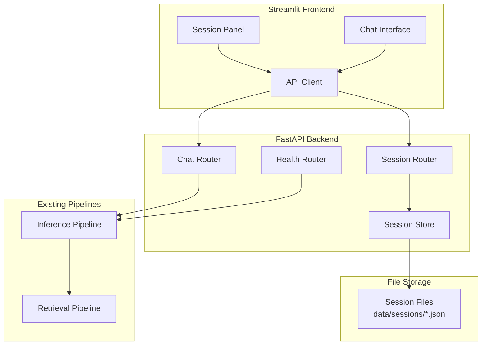

# Design Document: API and UI

## Overview

This module provides the web interface layer for the E-commerce RAG application. It consists of:
1. **FastAPI Backend** - REST API with streaming support, integrating with the inference pipeline
2. **Streamlit Frontend** - Chat interface with session history panel

The design prioritizes simplicity and follows a backend-first approach.

## Architecture



## Backend Components

### 1. FastAPI Application

Main entry point at `src/api/main.py`.

```python
from fastapi import FastAPI
from fastapi.middleware.cors import CORSMiddleware

app = FastAPI(
    title="E-Commerce Chat API",
    version="1.0.0"
)

# CORS middleware for frontend communication
app.add_middleware(
    CORSMiddleware,
    allow_origins=["*"],  # Configure for production
    allow_credentials=True,
    allow_methods=["*"],
    allow_headers=["*"],
)

# Include routers
app.include_router(chat_router, prefix="/api")
app.include_router(session_router, prefix="/api")
app.include_router(health_router, prefix="/api")
```

### 2. Chat Router

Handles chat requests at `src/api/routes/chat.py`.

```python
from fastapi import APIRouter, HTTPException
from fastapi.responses import StreamingResponse
from pydantic import BaseModel

router = APIRouter(tags=["chat"])

class ChatRequest(BaseModel):
    query: str
    session_id: str

class ChatResponse(BaseModel):
    response: str
    session_id: str
    metadata: dict = {}

@router.post("/chat")
async def chat(request: ChatRequest) -> ChatResponse:
    """Send a message and get a response."""
    pass

@router.post("/chat/stream")
async def chat_stream(request: ChatRequest):
    """Stream a response using Server-Sent Events."""
    pass
```

### 3. Session Store

File-based session storage at `src/api/services/session_store.py`.

```python
from dataclasses import dataclass
from datetime import datetime
from pathlib import Path
import json
import uuid

@dataclass
class SessionMessage:
    role: str  # "user" or "assistant"
    content: str
    timestamp: str

@dataclass 
class Session:
    session_id: str
    created_at: str
    updated_at: str
    messages: list[SessionMessage]
    preview: str  # First user message for display

class SessionStore:
    """File-based session storage."""
    
    def __init__(self, storage_dir: str = "data/sessions"):
        self.storage_dir = Path(storage_dir)
        self.storage_dir.mkdir(parents=True, exist_ok=True)
    
    def create_session(self) -> Session:
        """Create a new session with unique ID."""
        pass
    
    def get_session(self, session_id: str) -> Session:
        """Load session from file."""
        pass
    
    def list_sessions(self) -> list[Session]:
        """List all sessions sorted by most recent."""
        pass
    
    def add_message(self, session_id: str, role: str, content: str) -> None:
        """Add message to session and save to file."""
        pass
    
    def delete_session(self, session_id: str) -> None:
        """Delete session file."""
        pass
    
    def _get_session_path(self, session_id: str) -> Path:
        """Get file path for session."""
        return self.storage_dir / f"{session_id}.json"
```

### 4. Session Router

Session management endpoints at `src/api/routes/sessions.py`.

```python
from fastapi import APIRouter, HTTPException

router = APIRouter(tags=["sessions"])

@router.post("/sessions")
async def create_session():
    """Create a new chat session."""
    pass

@router.get("/sessions")
async def list_sessions():
    """List all sessions."""
    pass

@router.get("/sessions/{session_id}")
async def get_session(session_id: str):
    """Get a specific session."""
    pass

@router.delete("/sessions/{session_id}")
async def delete_session(session_id: str):
    """Delete a session (optional)."""
    pass
```

### 5. Health Router

Health check at `src/api/routes/health.py`.

```python
from fastapi import APIRouter

router = APIRouter(tags=["health"])

@router.get("/health")
async def health_check():
    """Check API and dependency health."""
    return {
        "status": "healthy",
        "services": {
            "api": "up",
            "inference_pipeline": "up"  # Check actual status
        }
    }
```

## Frontend Components

### 1. Main Application

Entry point at `src/frontend/app.py`.

```python
import streamlit as st

def main():
    st.set_page_config(
        page_title="E-Commerce Assistant",
        page_icon="🛒",
        layout="wide"
    )
    
    # Initialize session state
    initialize_session_state()
    
    # Render session panel in sidebar
    render_session_panel()
    
    # Render main content area
    render_main_content()
    
    # Render chat interface (collapsible, right corner)
    render_chat_interface()

if __name__ == "__main__":
    main()
```

### 2. Session Panel

Sidebar component at `src/frontend/components/session_panel.py`.

```python
import streamlit as st

def render_session_panel():
    """Render session history in sidebar."""
    with st.sidebar:
        st.title("💬 Chat History")
        
        # New Chat button
        if st.button("➕ New Chat", use_container_width=True):
            create_new_session()
        
        st.divider()
        
        # List past sessions
        sessions = get_all_sessions()
        for session in sessions:
            render_session_item(session)

def render_session_item(session):
    """Render a single session in the list."""
    # Show preview and timestamp
    # Highlight if current session
    # Click to load session (read-only)
    pass
```

### 3. Chat Interface

Collapsible chat at `src/frontend/components/chat_interface.py`.

```python
import streamlit as st

def render_chat_interface():
    """Render collapsible chat in right corner."""
    
    # Check if chat is expanded
    if not st.session_state.get("chat_expanded", True):
        render_chat_button()
    else:
        render_chat_window()

def render_chat_button():
    """Render collapsed chat button."""
    # Fixed position button in right corner
    pass

def render_chat_window():
    """Render expanded chat window."""
    # Header with minimize button
    render_chat_header()
    
    # Message display area
    render_messages()
    
    # Input area
    render_input()

def render_messages():
    """Render conversation messages."""
    for msg in st.session_state.messages:
        with st.chat_message(msg["role"]):
            st.markdown(msg["content"])

def render_input():
    """Render input field and send button."""
    if prompt := st.chat_input("Ask about products..."):
        handle_user_input(prompt)
```

### 4. API Client

Backend communication at `src/frontend/utils/api_client.py`.

```python
import httpx
from typing import AsyncIterator

class APIClient:
    """Client for FastAPI backend."""
    
    def __init__(self, base_url: str = "http://localhost:8000"):
        self.base_url = base_url
    
    def send_message(self, query: str, session_id: str) -> dict:
        """Send message and get response."""
        pass
    
    async def stream_message(self, query: str, session_id: str) -> AsyncIterator[str]:
        """Stream response chunks via SSE."""
        pass
    
    def create_session(self) -> dict:
        """Create new session."""
        pass
    
    def get_sessions(self) -> list:
        """Get all sessions."""
        pass
    
    def get_session(self, session_id: str) -> dict:
        """Get specific session."""
        pass
```

## Data Models

### API Request/Response Models

```python
from pydantic import BaseModel, Field
from typing import Optional
from datetime import datetime

class ChatRequest(BaseModel):
    query: str = Field(..., min_length=1, max_length=500)
    session_id: str

class ChatResponse(BaseModel):
    response: str
    session_id: str
    metadata: dict = {}

class SessionResponse(BaseModel):
    session_id: str
    created_at: datetime
    updated_at: datetime
    message_count: int
    preview: str

class SessionDetailResponse(BaseModel):
    session_id: str
    created_at: datetime
    updated_at: datetime
    messages: list[dict]

class HealthResponse(BaseModel):
    status: str
    services: dict
```

### Session File Format

Sessions stored as JSON in `data/sessions/{session_id}.json`:

```json
{
  "session_id": "sess_20241230_abc123",
  "created_at": "2024-12-30T10:00:00Z",
  "updated_at": "2024-12-30T10:05:00Z",
  "messages": [
    {
      "role": "user",
      "content": "What phones do you recommend?",
      "timestamp": "2024-12-30T10:00:00Z"
    },
    {
      "role": "assistant", 
      "content": "Based on our reviews...",
      "timestamp": "2024-12-30T10:00:05Z"
    }
  ]
}
```

## Configuration

### Backend Configuration

```python
from pydantic_settings import BaseSettings

class APISettings(BaseSettings):
    # Server
    host: str = "0.0.0.0"
    port: int = 8000
    
    # CORS
    cors_origins: list[str] = ["*"]
    
    # Sessions
    session_dir: str = "data/sessions"
    
    # Optional Auth
    api_key: str = ""  # Empty = disabled
    
    class Config:
        env_prefix = "API_"
        env_file = ".env"
```

### Frontend Configuration

```python
from pydantic_settings import BaseSettings

class FrontendSettings(BaseSettings):
    # API
    api_base_url: str = "http://localhost:8000"
    
    # Chat UI
    chat_width: int = 400
    max_input_length: int = 500
    
    class Config:
        env_prefix = "FRONTEND_"
        env_file = ".env"
```

## Correctness Properties

*A property is a characteristic or behavior that should hold true across all valid executions of a system.*

### Property 1: Chat Request Validation

*For any* chat request:
- If query is empty or whitespace-only, the API SHALL return 422 validation error
- If query exceeds max_length, the API SHALL return 422 validation error
- Valid requests SHALL include session_id in the response

**Validates: Requirements 1.2, 1.4, 1.5**

### Property 2: Streaming Response Completeness

*For any* streaming chat request that completes successfully:
- All chunks SHALL be delivered in order
- The final event SHALL indicate completion
- The concatenated chunks SHALL equal the complete response

**Validates: Requirements 2.3, 2.4**

### Property 3: Session Persistence

*For any* message added to a session:
- The message SHALL be persisted to the session file immediately
- Loading the session SHALL return all messages in order
- Session files SHALL be valid JSON

**Validates: Requirements 10.1, 10.3, 10.4**

### Property 4: Session Creation

*For any* new session creation:
- The session_id SHALL be unique
- The session_id SHALL include a timestamp component
- The session SHALL be immediately retrievable via GET /sessions/{id}

**Validates: Requirements 4.5, 9.6**

### Property 5: Session List Ordering

*For any* call to list sessions:
- Sessions SHALL be returned sorted by updated_at descending (most recent first)
- Each session SHALL include preview text from first user message

**Validates: Requirements 9.2, 9.8**

### Property 6: Health Check Accuracy

*For any* health check request:
- If all dependencies are available, status SHALL be "healthy"
- If any dependency is unavailable, status SHALL be "unhealthy" with details

**Validates: Requirements 3.2, 3.4**

### Property 7: Error Response Structure

*For any* API error:
- The response SHALL include an error code
- The response SHALL include a human-readable message
- HTTP status codes SHALL follow REST conventions (4xx for client, 5xx for server)

**Validates: Requirements 12.5**

## Error Handling

### API Error Responses

```python
from fastapi import HTTPException

class APIError(HTTPException):
    def __init__(self, status_code: int, error_code: str, message: str):
        super().__init__(
            status_code=status_code,
            detail={"error_code": error_code, "message": message}
        )

# Common errors
class SessionNotFoundError(APIError):
    def __init__(self, session_id: str):
        super().__init__(404, "SESSION_NOT_FOUND", f"Session {session_id} not found")

class ValidationError(APIError):
    def __init__(self, message: str):
        super().__init__(422, "VALIDATION_ERROR", message)

class InferenceError(APIError):
    def __init__(self, message: str):
        super().__init__(500, "INFERENCE_ERROR", message)
```

## Testing Strategy

### Unit Tests

1. **Session Store Tests**
   - Test session creation with unique IDs
   - Test message persistence
   - Test session loading
   - Test session listing order

2. **API Route Tests**
   - Test chat endpoint with valid/invalid requests
   - Test streaming endpoint
   - Test session CRUD operations
   - Test health endpoint

3. **API Client Tests**
   - Test request/response handling
   - Test streaming SSE parsing
   - Test error handling

### Property-Based Tests

```python
from hypothesis import given, strategies as st

@given(st.text(min_size=1, max_size=500))
def test_chat_request_valid_query(query):
    """Property 1: Valid queries should be accepted."""
    pass

@given(st.lists(st.text(min_size=1), min_size=1, max_size=10))
def test_session_message_persistence(messages):
    """Property 3: All messages should be persisted and retrievable."""
    pass
```

### Test Commands

```bash
# Run backend tests
uv run pytest tests/unit/test_api/ -v

# Run frontend tests  
uv run pytest tests/unit/test_frontend/ -v

# Run with coverage
uv run pytest tests/ --cov=src/api --cov=src/frontend --cov-report=html
```
