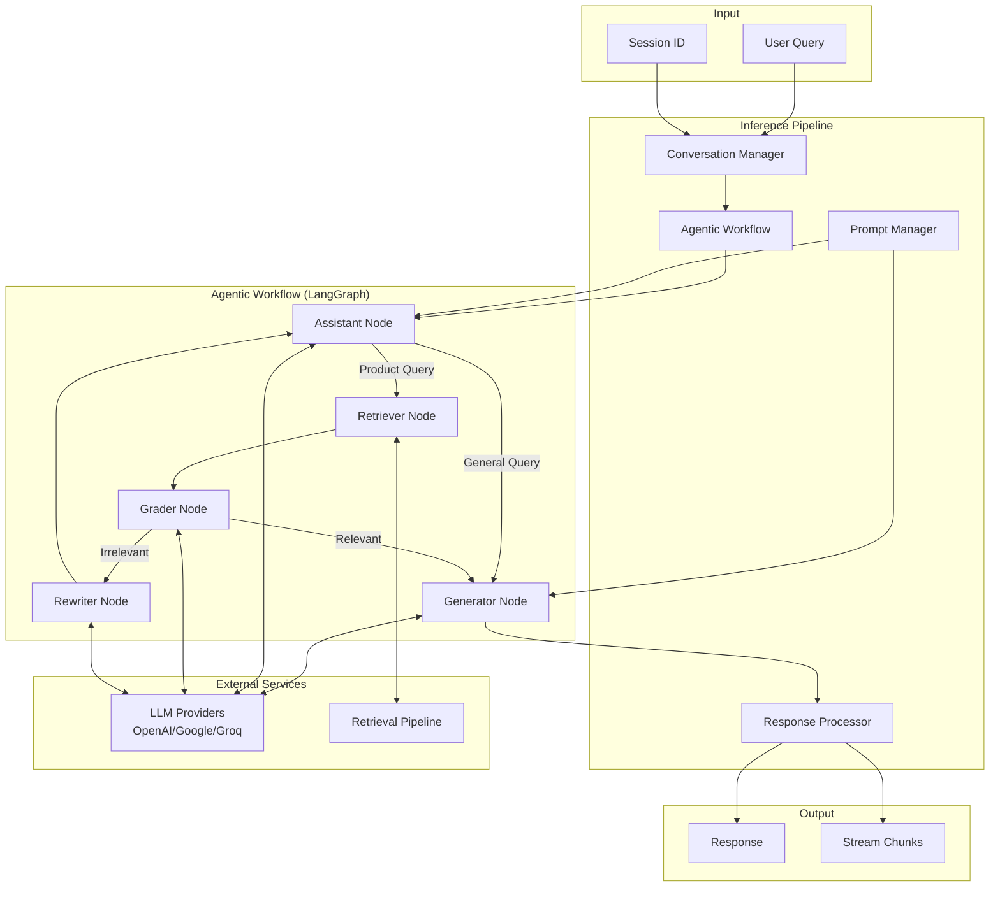

# Design Document: Data Inference Pipeline

## Overview

The Data Inference Pipeline generates conversational responses for e-commerce queries using Large Language Models. It implements an agentic workflow using LangGraph that intelligently routes queries, grades retrieved documents, and generates contextually relevant responses. The pipeline supports multiple LLM providers, manages conversation history, and provides streaming responses.

The design prioritizes:
- **Intelligence**: Agentic routing decides when to retrieve vs respond directly
- **Flexibility**: Multi-provider LLM support with easy switching
- **Conversational**: Session-based history for natural multi-turn interactions
- **Performance**: Streaming support for responsive user experience

## Architecture



## Components and Interfaces

### 1. LLM Provider

Unified interface for multiple LLM providers.

```python
from dataclasses import dataclass
from typing import Optional, AsyncIterator, List
from abc import ABC, abstractmethod
from langchain_core.messages import BaseMessage

@dataclass
class LLMConfig:
    provider: str  # "openai", "google", "groq"
    model_name: str
    temperature: float = 0.0
    max_tokens: int = 2048
    api_key: Optional[str] = None

@dataclass
class LLMResponse:
    content: str
    model: str
    tokens_used: int
    latency_ms: float

class BaseLLMProvider(ABC):
    """Abstract base class for LLM providers."""
    
    @abstractmethod
    def invoke(self, messages: List[BaseMessage]) -> LLMResponse:
        """Synchronous invocation."""
        pass
    
    @abstractmethod
    async def ainvoke(self, messages: List[BaseMessage]) -> LLMResponse:
        """Asynchronous invocation."""
        pass
    
    @abstractmethod
    async def astream(self, messages: List[BaseMessage]) -> AsyncIterator[str]:
        """Streaming invocation."""
        pass

class LLMProviderFactory:
    """Factory for creating LLM provider instances."""
    
    @staticmethod
    def create(config: LLMConfig) -> BaseLLMProvider:
        """Create appropriate LLM provider based on config."""
        pass

class OpenAIProvider(BaseLLMProvider):
    """OpenAI LLM provider implementation."""
    
    def __init__(self, config: LLMConfig):
        self.config = config
        self.client = None
    
    def initialize(self) -> None:
        """Initialize OpenAI client."""
        pass

# Note: Google and Groq providers will be implemented in future iterations
```

### 2. Prompt Manager

Manages prompt templates and construction.

```python
from dataclasses import dataclass
from typing import Dict, Any, Optional, List
from enum import Enum

class PromptType(Enum):
    SYSTEM = "system"
    USER = "user"
    ASSISTANT = "assistant"
    PRODUCT_BOT = "product_bot"
    GRADER = "grader"
    REWRITER = "rewriter"

@dataclass
class PromptTemplate:
    name: str
    template: str
    type: PromptType
    version: str = "1.0"
    variables: List[str] = None

@dataclass
class PromptConfig:
    max_context_tokens: int = 3000
    max_history_tokens: int = 1000
    truncation_strategy: str = "relevance"  # "relevance" or "recency"

class PromptManager:
    """Manages prompt templates and construction."""
    
    PROMPT_REGISTRY: Dict[PromptType, PromptTemplate] = {}
    
    def __init__(self, config: PromptConfig):
        self.config = config
        self._load_default_prompts()
    
    def _load_default_prompts(self) -> None:
        """Load default prompt templates."""
        pass
    
    def get_template(self, prompt_type: PromptType) -> PromptTemplate:
        """Get prompt template by type."""
        pass
    
    def construct_prompt(
        self,
        prompt_type: PromptType,
        variables: Dict[str, Any]
    ) -> str:
        """Construct prompt from template with variables."""
        pass
    
    def _validate_variables(
        self,
        template: PromptTemplate,
        variables: Dict[str, Any]
    ) -> None:
        """Validate all required variables are provided."""
        pass
    
    def _truncate_context(
        self,
        context: str,
        max_tokens: int
    ) -> str:
        """Truncate context to fit token limit."""
        pass
    
    def register_template(self, template: PromptTemplate) -> None:
        """Register a custom prompt template."""
        pass
```

### 3. Conversation Manager

Manages conversation sessions and history.

```python
from dataclasses import dataclass, field
from typing import List, Dict, Any, Optional
from datetime import datetime
from langchain_core.messages import BaseMessage, HumanMessage, AIMessage

@dataclass
class Message:
    role: str  # "user" or "assistant"
    content: str
    timestamp: datetime = field(default_factory=datetime.utcnow)
    metadata: Dict[str, Any] = field(default_factory=dict)

@dataclass
class Session:
    session_id: str
    messages: List[Message] = field(default_factory=list)
    created_at: datetime = field(default_factory=datetime.utcnow)
    updated_at: datetime = field(default_factory=datetime.utcnow)
    metadata: Dict[str, Any] = field(default_factory=dict)

@dataclass
class ConversationConfig:
    max_history_length: int = 10
    persist_sessions: bool = True
    storage_path: str = "data/sessions"

class ConversationManager:
    """Manages conversation sessions and history."""
    
    def __init__(self, config: ConversationConfig):
        self.config = config
        self._sessions: Dict[str, Session] = {}
    
    def get_or_create_session(self, session_id: str) -> Session:
        """Get existing session or create new one."""
        pass
    
    def add_message(
        self,
        session_id: str,
        role: str,
        content: str,
        metadata: Optional[Dict] = None
    ) -> None:
        """Add message to session history."""
        pass
    
    def get_history(
        self,
        session_id: str,
        limit: Optional[int] = None
    ) -> List[Message]:
        """Get conversation history for session."""
        pass
    
    def get_langchain_messages(
        self,
        session_id: str
    ) -> List[BaseMessage]:
        """Convert history to LangChain message format."""
        pass
    
    def clear_session(self, session_id: str) -> None:
        """Clear all messages from session."""
        pass
    
    def delete_session(self, session_id: str) -> None:
        """Delete session entirely."""
        pass
    
    def _trim_history(self, session: Session) -> None:
        """Remove oldest messages if history exceeds limit."""
        pass
    
    def _persist_session(self, session: Session) -> None:
        """Persist session to storage."""
        pass
    
    def _load_session(self, session_id: str) -> Optional[Session]:
        """Load session from storage."""
        pass
```

### 4. Agentic Workflow

LangGraph-based workflow for intelligent query routing.

```python
from typing import Annotated, Sequence, TypedDict, Literal
from langchain_core.messages import BaseMessage
from langgraph.graph import StateGraph, START, END
from langgraph.graph.message import add_messages
from langgraph.checkpoint.memory import MemorySaver

class AgentState(TypedDict):
    """State for the agentic workflow."""
    messages: Annotated[Sequence[BaseMessage], add_messages]
    context: str
    query_rewrite_count: int

class AgenticWorkflow:
    """LangGraph-based agentic RAG workflow."""
    
    def __init__(
        self,
        llm_provider: BaseLLMProvider,
        retrieval_pipeline,  # RetrievalPipeline from retrieval module
        prompt_manager: PromptManager
    ):
        self.llm = llm_provider
        self.retriever = retrieval_pipeline
        self.prompt_manager = prompt_manager
        self.checkpointer = MemorySaver()
        self.workflow = self._build_workflow()
        self.app = self.workflow.compile(checkpointer=self.checkpointer)
    
    def _build_workflow(self) -> StateGraph:
        """Build the LangGraph workflow."""
        pass
    
    def _assistant_node(self, state: AgentState) -> dict:
        """Route query to retriever or respond directly."""
        pass
    
    def _retriever_node(self, state: AgentState) -> dict:
        """Retrieve relevant documents."""
        pass
    
    def _grader_node(self, state: AgentState) -> Literal["generator", "rewriter"]:
        """Grade document relevance."""
        pass
    
    def _generator_node(self, state: AgentState) -> dict:
        """Generate response using context."""
        pass
    
    def _rewriter_node(self, state: AgentState) -> dict:
        """Rewrite query for better retrieval."""
        pass
    
    def _should_retrieve(self, query: str) -> bool:
        """Determine if query needs retrieval."""
        pass
    
    def run(
        self,
        query: str,
        session_id: str = "default"
    ) -> str:
        """Execute workflow and return response."""
        pass
    
    async def arun(
        self,
        query: str,
        session_id: str = "default"
    ) -> str:
        """Async workflow execution."""
        pass
```

### 5. Response Processor

Validates and formats LLM responses.

```python
from dataclasses import dataclass, field
from typing import List, Dict, Any, Optional
import re

@dataclass
class ProductRecommendation:
    product_name: str
    price: Optional[str] = None
    rating: Optional[str] = None
    reason: Optional[str] = None

@dataclass
class ProcessedResponse:
    content: str
    recommendations: List[ProductRecommendation] = field(default_factory=list)
    citations: List[str] = field(default_factory=list)
    metadata: Dict[str, Any] = field(default_factory=dict)

@dataclass
class ProcessorConfig:
    enable_markdown: bool = True
    extract_recommendations: bool = True
    sanitize_content: bool = True
    max_response_length: int = 4000

class ResponseProcessor:
    """Processes and formats LLM responses."""
    
    def __init__(self, config: ProcessorConfig):
        self.config = config
    
    def process(
        self,
        raw_response: str,
        context_metadata: Optional[Dict] = None
    ) -> ProcessedResponse:
        """Process raw LLM response."""
        pass
    
    def _validate_response(self, response: str) -> None:
        """Validate response is non-empty and well-formed."""
        pass
    
    def _format_markdown(self, response: str) -> str:
        """Apply markdown formatting."""
        pass
    
    def _extract_recommendations(
        self,
        response: str
    ) -> List[ProductRecommendation]:
        """Extract product recommendations from response."""
        pass
    
    def _extract_citations(
        self,
        response: str,
        context_metadata: Dict
    ) -> List[str]:
        """Extract source citations from response."""
        pass
    
    def _sanitize(self, response: str) -> str:
        """Remove harmful or inappropriate content."""
        pass
    
    def _truncate(self, response: str) -> str:
        """Truncate response if exceeds max length."""
        pass
```

### 6. Inference Pipeline Orchestrator

Coordinates all components for end-to-end inference.

```python
from dataclasses import dataclass, field
from typing import Optional, Dict, Any, AsyncIterator
from datetime import datetime

@dataclass
class InferenceConfig:
    llm_config: LLMConfig
    prompt_config: PromptConfig
    conversation_config: ConversationConfig
    processor_config: ProcessorConfig
    enable_streaming: bool = True
    max_retries: int = 3
    timeout_seconds: int = 30

@dataclass
class InferenceResult:
    query: str
    response: str
    session_id: str
    recommendations: List[ProductRecommendation] = field(default_factory=list)
    citations: List[str] = field(default_factory=list)
    metadata: Dict[str, Any] = field(default_factory=dict)
    latency_ms: float = 0.0
    tokens_used: int = 0

class InferencePipeline:
    """Orchestrates the complete inference workflow."""
    
    def __init__(self, config: InferenceConfig, retrieval_pipeline):
        self.config = config
        self.retrieval_pipeline = retrieval_pipeline
        self.llm_provider = None
        self.prompt_manager = None
        self.conversation_manager = None
        self.agentic_workflow = None
        self.response_processor = None
    
    def initialize(self) -> None:
        """Initialize all pipeline components."""
        pass
    
    def generate(
        self,
        query: str,
        session_id: str = "default"
    ) -> InferenceResult:
        """Generate response synchronously."""
        pass
    
    async def agenerate(
        self,
        query: str,
        session_id: str = "default"
    ) -> InferenceResult:
        """Generate response asynchronously."""
        pass
    
    async def stream(
        self,
        query: str,
        session_id: str = "default"
    ) -> AsyncIterator[str]:
        """Stream response chunks."""
        pass
    
    def _execute_with_retry(
        self,
        func,
        *args,
        **kwargs
    ) -> Any:
        """Execute function with retry logic."""
        pass
    
    def _handle_timeout(self, func, timeout: int) -> Any:
        """Execute function with timeout."""
        pass
    
    def get_session_history(
        self,
        session_id: str
    ) -> List[Message]:
        """Get conversation history for session."""
        pass
    
    def clear_session(self, session_id: str) -> None:
        """Clear session history."""
        pass
```

## Data Models

### Response Schema

```python
from pydantic import BaseModel, Field
from typing import List, Dict, Any, Optional
from datetime import datetime

class ProductRecommendationModel(BaseModel):
    """Product recommendation extracted from response."""
    product_name: str
    price: Optional[str] = None
    rating: Optional[str] = None
    reason: Optional[str] = None

class InferenceMetadata(BaseModel):
    """Metadata about the inference operation."""
    model_used: str
    tokens_input: int
    tokens_output: int
    latency_ms: float
    retrieval_used: bool
    query_rewritten: bool = False
    rewrite_count: int = 0

class InferenceResponse(BaseModel):
    """Complete inference response."""
    query: str
    response: str
    session_id: str
    recommendations: List[ProductRecommendationModel] = []
    citations: List[str] = []
    metadata: InferenceMetadata
    timestamp: datetime = Field(default_factory=datetime.utcnow)

class StreamChunk(BaseModel):
    """Single chunk in streaming response."""
    content: str
    is_final: bool = False
    error: Optional[str] = None
```

### Configuration Schema

```python
from pydantic import BaseSettings, Field
from typing import Optional

class InferenceSettings(BaseSettings):
    """Environment-based configuration for inference."""
    
    # API Keys (OpenAI only for initial implementation)
    openai_api_key: Optional[str] = Field(default=None, env="OPENAI_API_KEY")
    
    # LLM Provider Selection (OpenAI only for now)
    llm_provider: str = Field(default="openai", env="LLM_PROVIDER")
    
    # Model Settings
    model_name: Optional[str] = Field(default=None)  # Uses provider default if not set
    temperature: float = Field(default=0.0)
    max_tokens: int = Field(default=2048)
    
    # Conversation Settings
    max_history_length: int = Field(default=10)
    persist_sessions: bool = Field(default=True)
    
    # Streaming Settings
    enable_streaming: bool = Field(default=True)
    
    # Retry Settings
    max_retries: int = Field(default=3)
    timeout_seconds: int = Field(default=30)
    
    class Config:
        env_file = ".env"
        env_file_encoding = "utf-8"
```

## Default Prompts

```python
PRODUCT_BOT_PROMPT = """You are a helpful e-commerce assistant specializing in phone products.
Use the following context to answer the user's question accurately.

Context:
{context}

Conversation History:
{history}

User Question: {question}

Instructions:
- Provide accurate information based on the context
- If recommending products, include price and rating when available
- Be conversational and helpful
- If you don't have enough information, say so honestly
- Cite specific products when making recommendations

Response:"""

GRADER_PROMPT = """You are a grader assessing relevance of retrieved documents to a user question.

Question: {question}

Documents:
{documents}

Are these documents relevant to answering the question? Answer 'yes' or 'no'."""

REWRITER_PROMPT = """You are a query rewriter. Rewrite the following query to be clearer and more specific for product search.

Original Query: {query}

Rewritten Query:"""
```


## Correctness Properties

*A property is a characteristic or behavior that should hold true across all valid executions of a system—essentially, a formal statement about what the system should do. Properties serve as the bridge between human-readable specifications and machine-verifiable correctness guarantees.*

### Property 1: Missing API Key Detection

*For any* LLM provider configuration where the required API key is missing or empty, the LLM_Provider initialization SHALL raise a ConfigurationError specifying the missing key.

**Validates: Requirements 1.4, 8.3**

### Property 2: Retry Logic with Exponential Backoff

*For any* transient API failure:
- The LLM_Provider SHALL retry up to max_retries times
- Each retry delay SHALL be greater than the previous delay (exponential backoff)
- The total attempt count SHALL be <= (max_retries + 1)

**Validates: Requirements 1.6, 9.2**

### Property 3: Template Variable Handling

*For any* prompt template with variables {v1, v2, ...}:
- If all variables are provided, the constructed prompt SHALL contain the substituted values
- If any required variable is missing, a TemplateError SHALL be raised listing the missing variable

**Validates: Requirements 2.2, 2.3**

### Property 4: Prompt Token Limit Validation

*For any* constructed prompt, if the token count exceeds the model's maximum context length, the Prompt_Manager SHALL either truncate the prompt or raise a TokenLimitError.

**Validates: Requirements 2.6**

### Property 5: Context Injection and Formatting

*For any* context injection operation:
- The context SHALL appear in the constructed prompt at the designated location
- The formatted context SHALL contain product_name, price, rating, and review content
- If context exceeds max_context_tokens, it SHALL be truncated to fit
- Context metadata SHALL be preserved for citation extraction

**Validates: Requirements 3.1, 3.2, 3.3, 3.5**

### Property 6: Session Management

*For any* conversation session:
- Messages added to a session SHALL be retrievable in order
- If history exceeds max_history_length, the oldest messages SHALL be removed first
- Sessions SHALL be persistable and loadable from storage
- For a non-existent session_id, a new session SHALL be created automatically
- Session deletion SHALL remove all associated messages

**Validates: Requirements 4.1, 4.3, 4.4, 4.5, 4.6**

### Property 7: Query Routing

*For any* user query:
- If the query contains product-related keywords (price, review, product, recommend), it SHALL be routed to the retriever
- If the query is general (greetings, general questions), it SHALL be routed directly to the LLM without retrieval

**Validates: Requirements 5.4, 6.2, 6.3**

### Property 8: Query Rewriting Trigger

*For any* retrieval operation where the grader determines documents are irrelevant, the Agentic_Workflow SHALL trigger query rewriting before re-attempting retrieval.

**Validates: Requirements 6.5**

### Property 9: Response Processing

*For any* LLM response processed by Response_Processor:
- Empty responses SHALL raise a ValidationError
- Product recommendations SHALL be extracted and structured if present
- Response metadata SHALL include latency_ms, model_used, and tokens_used

**Validates: Requirements 7.1, 7.3, 7.5**

### Property 10: Timeout Handling

*For any* inference operation, if execution time exceeds timeout_seconds, the operation SHALL be terminated and a TimeoutError SHALL be raised or a graceful timeout response returned.

**Validates: Requirements 9.5**

### Property 11: Streaming Behavior

*For any* streaming inference operation:
- Response chunks SHALL be yielded as they arrive from the LLM
- Token usage SHALL be tracked and available after streaming completes
- The final chunk SHALL have is_final=True

**Validates: Requirements 10.2, 10.5**

## Error Handling

### Custom Exception Hierarchy

```python
class InferenceError(Exception):
    """Base exception for inference pipeline errors."""
    pass

class ConfigurationError(InferenceError):
    """Raised when configuration is invalid or missing."""
    def __init__(self, message: str, missing_keys: list = None):
        super().__init__(message)
        self.missing_keys = missing_keys or []

class TemplateError(InferenceError):
    """Raised when prompt template processing fails."""
    def __init__(self, message: str, missing_variables: list = None):
        super().__init__(message)
        self.missing_variables = missing_variables or []

class TokenLimitError(InferenceError):
    """Raised when prompt exceeds token limit."""
    def __init__(self, message: str, token_count: int = None, limit: int = None):
        super().__init__(message)
        self.token_count = token_count
        self.limit = limit

class LLMError(InferenceError):
    """Raised when LLM API call fails."""
    def __init__(self, message: str, provider: str = None, status_code: int = None):
        super().__init__(message)
        self.provider = provider
        self.status_code = status_code

class SessionError(InferenceError):
    """Raised when session operations fail."""
    def __init__(self, message: str, session_id: str = None):
        super().__init__(message)
        self.session_id = session_id

class StreamingError(InferenceError):
    """Raised when streaming fails mid-response."""
    def __init__(self, message: str, partial_response: str = None):
        super().__init__(message)
        self.partial_response = partial_response
```

### Error Handling Strategy

| Component | Error Type | Handling |
|-----------|-----------|----------|
| LLM Provider | Missing API key | Raise ConfigurationError |
| LLM Provider | API failure | Retry with backoff, then raise LLMError |
| Prompt Manager | Missing variable | Raise TemplateError |
| Prompt Manager | Token limit exceeded | Truncate or raise TokenLimitError |
| Conversation Manager | Session not found | Create new session |
| Agentic Workflow | Grader failure | Default to generator path |
| Response Processor | Empty response | Raise ValidationError |
| Streaming | Mid-stream failure | Return partial with error flag |

## Testing Strategy

### Testing Framework

- **Framework**: pytest with pytest-asyncio for async tests
- **Property Testing**: hypothesis for property-based tests
- **Mocking**: unittest.mock for LLM API mocking
- **Coverage**: pytest-cov with minimum 80% coverage target

### Unit Tests

1. **LLMProvider Tests**
   - Test provider initialization with valid/invalid keys
   - Test retry logic with mocked failures
   - Test timeout handling

2. **PromptManager Tests**
   - Test template loading and registration
   - Test variable substitution
   - Test missing variable detection
   - Test token limit validation

3. **ConversationManager Tests**
   - Test session creation and retrieval
   - Test message history management
   - Test history trimming
   - Test persistence and loading

4. **AgenticWorkflow Tests**
   - Test query routing logic
   - Test grader decision making
   - Test rewriter triggering
   - Test workflow state transitions

5. **ResponseProcessor Tests**
   - Test empty response validation
   - Test recommendation extraction
   - Test metadata addition
   - Test sanitization

### Property-Based Tests

```python
from hypothesis import given, strategies as st

@given(st.dictionaries(
    keys=st.sampled_from(['context', 'question', 'history']),
    values=st.text(min_size=1),
    min_size=0
))
def test_template_variable_handling(variables):
    """
    Feature: data-inference-pipeline, Property 3: Template Variable Handling
    Missing required variables should raise TemplateError.
    """
    # Test implementation
    pass

@given(st.lists(
    st.fixed_dictionaries({
        'role': st.sampled_from(['user', 'assistant']),
        'content': st.text(min_size=1)
    }),
    min_size=0,
    max_size=20
))
def test_session_management(messages):
    """
    Feature: data-inference-pipeline, Property 6: Session Management
    Messages should be stored and retrievable, with oldest trimmed when exceeding limit.
    """
    # Test implementation
    pass
```

### Integration Tests

1. **Pipeline Integration**
   - Test full inference flow with mocked LLM
   - Test conversation continuity across calls
   - Test streaming end-to-end

2. **Workflow Integration**
   - Test complete agentic workflow with mocked retriever
   - Test query routing decisions
   - Test rewrite loop behavior

### Test Commands

```bash
# Run all tests
uv run pytest tests/unit/test_inference/ -v

# Run with coverage
uv run pytest tests/ --cov=src/pipelines/inference --cov-report=html

# Run property tests only
uv run pytest tests/ -v -m "property"

# Run async tests
uv run pytest tests/ -v -m "asyncio"
```
