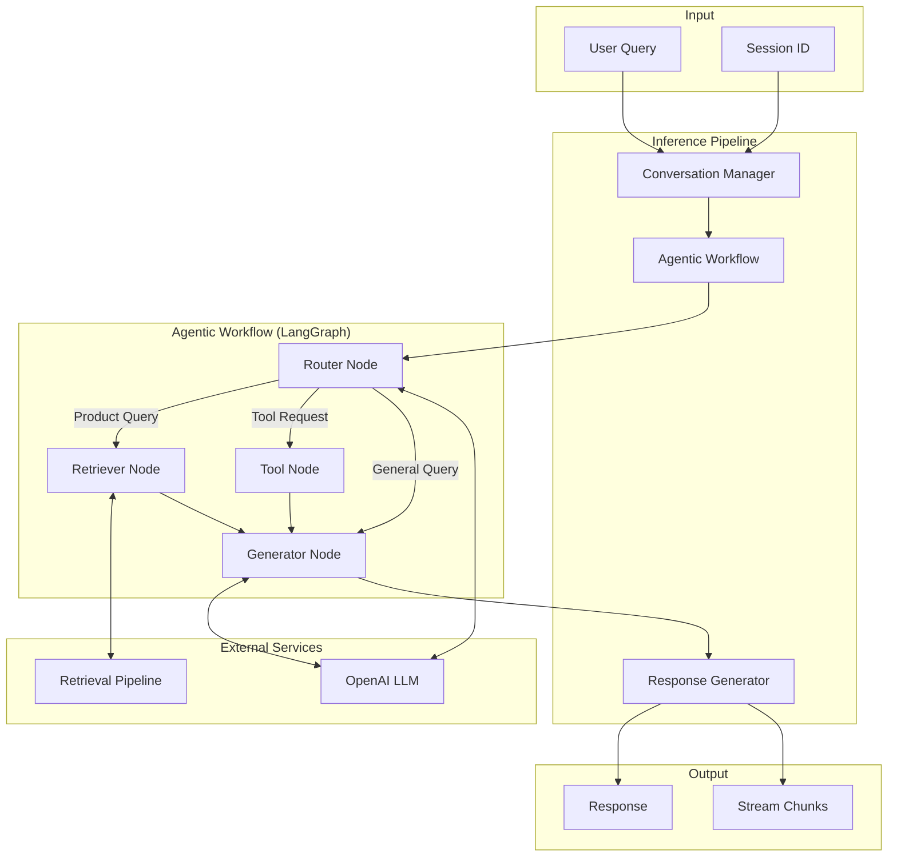

# Design Document: Data Inference Pipeline

## Overview

The Data Inference Pipeline generates conversational responses for e-commerce queries using Large Language Models. It implements a simplified agentic workflow using LangGraph with three main nodes (Router → Retriever → Generator) plus a demonstration Tool node for future extensibility. The pipeline manages in-memory conversation history and provides streaming responses.

The design prioritizes:
- **Simplicity**: Clean 3-node workflow with clear responsibilities
- **Extensibility**: Tool node demonstrates agentic capability for future MCP/tools integration
- **Conversational**: In-memory session history for natural multi-turn interactions
- **Performance**: Streaming support for responsive user experience

## Architecture



## Components and Interfaces

### 1. LLM Client

Configurable interface for OpenAI LLM (designed for future provider extensibility).

```python
from dataclasses import dataclass
from typing import Optional, AsyncIterator, List
from langchain_core.messages import BaseMessage

@dataclass
class LLMConfig:
    provider: str = "openai"  # Only OpenAI for MVP
    model_name: str = "gpt-4o-mini"
    temperature: float = 0.0
    max_tokens: int = 2048
    api_key: Optional[str] = None

@dataclass
class LLMResponse:
    content: str
    model: str
    tokens_used: int
    latency_ms: float

class LLMClient:
    """OpenAI LLM client with retry logic and streaming support."""
    
    def __init__(self, config: LLMConfig):
        self.config = config
        self.client = None
    
    def initialize(self) -> None:
        """Initialize OpenAI client with API key validation."""
        pass
    
    def invoke(self, messages: List[BaseMessage]) -> LLMResponse:
        """Synchronous invocation."""
        pass
    
    async def ainvoke(self, messages: List[BaseMessage]) -> LLMResponse:
        """Asynchronous invocation."""
        pass
    
    async def astream(self, messages: List[BaseMessage]) -> AsyncIterator[str]:
        """Streaming invocation yielding response chunks."""
        pass
    
    def _execute_with_retry(self, func, *args, **kwargs):
        """Execute with exponential backoff retry logic."""
        pass
```

### 2. Conversation Manager

Manages in-memory conversation sessions and history.

```python
from dataclasses import dataclass, field
from typing import List, Dict, Optional
from datetime import datetime
from langchain_core.messages import BaseMessage, HumanMessage, AIMessage

@dataclass
class Message:
    role: str  # "user" or "assistant"
    content: str
    timestamp: datetime = field(default_factory=datetime.utcnow)

@dataclass
class Session:
    session_id: str
    messages: List[Message] = field(default_factory=list)
    created_at: datetime = field(default_factory=datetime.utcnow)

@dataclass
class ConversationConfig:
    max_history_length: int = 10

class ConversationManager:
    """Manages in-memory conversation sessions."""
    
    def __init__(self, config: ConversationConfig):
        self.config = config
        self._sessions: Dict[str, Session] = {}
    
    def get_or_create_session(self, session_id: str) -> Session:
        """Get existing session or create new one."""
        pass
    
    def add_message(self, session_id: str, role: str, content: str) -> None:
        """Add message to session history."""
        pass
    
    def get_history(self, session_id: str, limit: Optional[int] = None) -> List[Message]:
        """Get conversation history for session."""
        pass
    
    def get_langchain_messages(self, session_id: str) -> List[BaseMessage]:
        """Convert history to LangChain message format."""
        pass
    
    def clear_session(self, session_id: str) -> None:
        """Clear all messages from session."""
        pass
    
    def _trim_history(self, session: Session) -> None:
        """Remove oldest messages if history exceeds limit."""
        pass
```

### 3. Response Generator

Constructs prompts and generates LLM responses with context injection.

```python
from dataclasses import dataclass
from typing import Optional, List
from langchain_core.messages import BaseMessage

@dataclass
class GeneratorConfig:
    system_prompt: str = None  # Uses default e-commerce prompt if None
    max_context_tokens: int = 3000

class ResponseGenerator:
    """Generates LLM responses with context and history injection."""
    
    DEFAULT_SYSTEM_PROMPT = """You are a helpful e-commerce assistant specializing in phone products.
Use the provided context to answer questions accurately.
If recommending products, include price and rating when available.
Be conversational and helpful. If you don't have enough information, say so honestly."""
    
    def __init__(self, config: GeneratorConfig, llm_client: 'LLMClient'):
        self.config = config
        self.llm_client = llm_client
    
    def generate(
        self,
        query: str,
        context: Optional[str] = None,
        history: Optional[List[BaseMessage]] = None
    ) -> str:
        """Generate response synchronously."""
        pass
    
    async def agenerate(
        self,
        query: str,
        context: Optional[str] = None,
        history: Optional[List[BaseMessage]] = None
    ) -> str:
        """Generate response asynchronously."""
        pass
    
    async def astream(
        self,
        query: str,
        context: Optional[str] = None,
        history: Optional[List[BaseMessage]] = None
    ) -> AsyncIterator[str]:
        """Stream response chunks."""
        pass
    
    def _build_messages(
        self,
        query: str,
        context: Optional[str],
        history: Optional[List[BaseMessage]]
    ) -> List[BaseMessage]:
        """Build message list for LLM."""
        pass
```

### 4. Agentic Workflow

LangGraph-based workflow with Router, Retriever, Tool, and Generator nodes.

```python
from typing import Annotated, Sequence, TypedDict, Literal, List
from langchain_core.messages import BaseMessage
from langgraph.graph import StateGraph, START, END
from langgraph.graph.message import add_messages

class AgentState(TypedDict):
    """State for the agentic workflow."""
    messages: Annotated[Sequence[BaseMessage], add_messages]
    context: str
    route: str  # "retrieve", "tool", "respond"
    tool_result: str

@dataclass
class WorkflowConfig:
    product_keywords: List[str] = field(default_factory=lambda: [
        "price", "review", "product", "recommend", "compare", "rating", "phone"
    ])
    tool_keywords: List[str] = field(default_factory=lambda: ["compare"])

class AgenticWorkflow:
    """LangGraph-based agentic RAG workflow with 3 main nodes + tool node."""
    
    def __init__(
        self,
        config: WorkflowConfig,
        llm_client: 'LLMClient',
        retrieval_pipeline,  # RetrievalPipeline from retrieval module
        response_generator: 'ResponseGenerator'
    ):
        self.config = config
        self.llm_client = llm_client
        self.retriever = retrieval_pipeline
        self.generator = response_generator
        self.workflow = self._build_workflow()
        self.app = self.workflow.compile()
    
    def _build_workflow(self) -> StateGraph:
        """Build the LangGraph workflow with Router → Retriever/Tool → Generator."""
        pass
    
    def _router_node(self, state: AgentState) -> dict:
        """Route query to retriever, tool, or direct response."""
        pass
    
    def _retriever_node(self, state: AgentState) -> dict:
        """Retrieve relevant documents using retrieval pipeline."""
        pass
    
    def _tool_node(self, state: AgentState) -> dict:
        """Execute tool (product comparison demo)."""
        pass
    
    def _generator_node(self, state: AgentState) -> dict:
        """Generate final response using context."""
        pass
    
    def _route_decision(self, state: AgentState) -> Literal["retriever", "tool", "generator"]:
        """Conditional edge: decide next node based on route."""
        pass
    
    def run(self, query: str, history: List[BaseMessage] = None) -> str:
        """Execute workflow and return response."""
        pass
    
    async def arun(self, query: str, history: List[BaseMessage] = None) -> str:
        """Async workflow execution."""
        pass
```

### 5. Inference Pipeline Orchestrator

Coordinates all components for end-to-end inference.

```python
from dataclasses import dataclass, field
from typing import Optional, Dict, Any, AsyncIterator, List
from datetime import datetime

@dataclass
class InferenceConfig:
    llm_config: LLMConfig
    conversation_config: ConversationConfig
    generator_config: GeneratorConfig
    workflow_config: WorkflowConfig
    enable_streaming: bool = True
    max_retries: int = 3
    timeout_seconds: int = 30

@dataclass
class InferenceResult:
    query: str
    response: str
    session_id: str
    metadata: Dict[str, Any] = field(default_factory=dict)
    latency_ms: float = 0.0
    tokens_used: int = 0
    timestamp: datetime = field(default_factory=datetime.utcnow)

class InferencePipeline:
    """Orchestrates the complete inference workflow."""
    
    def __init__(self, config: InferenceConfig, retrieval_pipeline):
        self.config = config
        self.retrieval_pipeline = retrieval_pipeline
        self.llm_client = None
        self.conversation_manager = None
        self.response_generator = None
        self.agentic_workflow = None
        self._initialized = False
    
    def initialize(self) -> None:
        """Initialize all pipeline components."""
        pass
    
    @classmethod
    def from_config_file(cls, config_path: str = None) -> 'InferencePipeline':
        """Create pipeline from YAML configuration file."""
        pass
    
    def generate(self, query: str, session_id: str = "default") -> InferenceResult:
        """Generate response synchronously."""
        pass
    
    async def agenerate(self, query: str, session_id: str = "default") -> InferenceResult:
        """Generate response asynchronously."""
        pass
    
    async def stream(self, query: str, session_id: str = "default") -> AsyncIterator[str]:
        """Stream response chunks."""
        pass
    
    def _execute_with_timeout(self, func, timeout: int, *args, **kwargs) -> Any:
        """Execute function with timeout handling."""
        pass
    
    def get_session_history(self, session_id: str) -> List[Message]:
        """Get conversation history for session."""
        pass
    
    def clear_session(self, session_id: str) -> None:
        """Clear session history."""
        pass
```

## Data Models

### Response Schema

```python
from pydantic import BaseModel, Field
from typing import Dict, Any, Optional
from datetime import datetime

class InferenceMetadata(BaseModel):
    """Metadata about the inference operation."""
    model_used: str
    tokens_input: int
    tokens_output: int
    latency_ms: float
    retrieval_used: bool
    tool_used: bool = False
    route_taken: str  # "retrieve", "tool", "respond"

class InferenceResponse(BaseModel):
    """Complete inference response."""
    query: str
    response: str
    session_id: str
    metadata: InferenceMetadata
    timestamp: datetime = Field(default_factory=datetime.utcnow)

class StreamChunk(BaseModel):
    """Single chunk in streaming response."""
    content: str
    is_final: bool = False
    error: Optional[str] = None
```

### Configuration Schema

```python
from pydantic_settings import BaseSettings
from pydantic import Field
from typing import Optional

class InferenceSettings(BaseSettings):
    """Environment-based configuration for inference."""
    
    # API Keys
    openai_api_key: str = Field(..., env="OPENAI_API_KEY")
    
    # Model Settings
    model_name: str = Field(default="gpt-4o-mini")
    temperature: float = Field(default=0.0)
    max_tokens: int = Field(default=2048)
    
    # Conversation Settings
    max_history_length: int = Field(default=10)
    
    # Streaming Settings
    enable_streaming: bool = Field(default=True)
    
    # Retry Settings
    max_retries: int = Field(default=3)
    timeout_seconds: int = Field(default=30)
    
    class Config:
        env_file = ".env"
        env_file_encoding = "utf-8"
```

## Default Prompts

```python
SYSTEM_PROMPT = """You are a helpful e-commerce assistant specializing in phone products.
Use the provided context to answer questions accurately.

Instructions:
- Provide accurate information based on the context
- If recommending products, include price and rating when available
- Be conversational and helpful
- If you don't have enough information, say so honestly
- Cite specific products when making recommendations"""

ROUTER_PROMPT = """Classify the user query into one of these categories:
- "retrieve": Product-related questions needing database lookup
- "tool": Requests to compare products
- "respond": General conversation, greetings, or questions answerable without retrieval

Query: {query}

Category:"""
```

## Correctness Properties

### Property 1: Missing API Key Detection

*For any* LLM client initialization where the OpenAI API key is missing or empty, the LLM_Client SHALL raise a ConfigurationError.

**Validates: Requirements 1.3**

### Property 2: Retry Logic with Exponential Backoff

*For any* transient API failure:
- The LLM_Client SHALL retry up to max_retries times
- Each retry delay SHALL be greater than the previous delay
- The total attempt count SHALL be <= (max_retries + 1)

**Validates: Requirements 1.4, 7.2**

### Property 3: Session Management

*For any* conversation session:
- Messages added to a session SHALL be retrievable in order
- If history exceeds max_history_length, the oldest messages SHALL be removed first
- For a non-existent session_id, a new session SHALL be created automatically

**Validates: Requirements 2.1, 2.3, 2.5**

### Property 4: Query Routing

*For any* user query:
- If the query contains product-related keywords, it SHALL be routed to the retriever
- If the query contains tool keywords (compare), it SHALL be routed to the tool node
- General queries SHALL be routed directly to the generator

**Validates: Requirements 4.2, 4.3, 4.4**

### Property 5: Context Injection

*For any* response generation with context:
- The context SHALL be included in the prompt sent to the LLM
- If no context is available, the generator SHALL respond based on history only

**Validates: Requirements 3.3, 3.4**

### Property 6: Streaming Behavior

*For any* streaming inference operation:
- Response chunks SHALL be yielded as they arrive from the LLM
- The final chunk SHALL indicate completion
- Mid-stream failures SHALL return partial response with error indicator

**Validates: Requirements 5.1, 5.2, 5.4**

### Property 7: Timeout Handling

*For any* inference operation, if execution time exceeds timeout_seconds, the operation SHALL be terminated and a graceful error response returned.

**Validates: Requirements 7.5**

## Error Handling

### Custom Exception Hierarchy

```python
class InferenceError(Exception):
    """Base exception for inference pipeline errors."""
    pass

class ConfigurationError(InferenceError):
    """Raised when configuration is invalid or missing."""
    def __init__(self, message: str, missing_keys: list = None):
        super().__init__(message)
        self.missing_keys = missing_keys or []

class LLMError(InferenceError):
    """Raised when LLM API call fails."""
    def __init__(self, message: str, status_code: int = None):
        super().__init__(message)
        self.status_code = status_code

class SessionError(InferenceError):
    """Raised when session operations fail."""
    def __init__(self, message: str, session_id: str = None):
        super().__init__(message)
        self.session_id = session_id

class StreamingError(InferenceError):
    """Raised when streaming fails mid-response."""
    def __init__(self, message: str, partial_response: str = None):
        super().__init__(message)
        self.partial_response = partial_response

class TimeoutError(InferenceError):
    """Raised when operation exceeds timeout."""
    def __init__(self, message: str, timeout_seconds: int = None):
        super().__init__(message)
        self.timeout_seconds = timeout_seconds
```

### Error Handling Strategy

| Component | Error Type | Handling |
|-----------|-----------|----------|
| LLM Client | Missing API key | Raise ConfigurationError |
| LLM Client | API failure | Retry with backoff, then raise LLMError |
| Conversation Manager | Session not found | Create new session |
| Agentic Workflow | Retrieval failure | Respond without context |
| Streaming | Mid-stream failure | Return partial with error flag |
| Pipeline | Timeout | Return graceful error message |

## Testing Strategy

### Unit Tests

1. **LLMClient Tests**
   - Test initialization with valid/invalid API keys
   - Test retry logic with mocked failures
   - Test streaming with mocked responses

2. **ConversationManager Tests**
   - Test session creation and retrieval
   - Test message history management
   - Test history trimming

3. **ResponseGenerator Tests**
   - Test prompt construction
   - Test context injection
   - Test history inclusion

4. **AgenticWorkflow Tests**
   - Test query routing logic
   - Test retriever node integration
   - Test tool node execution
   - Test workflow state transitions

### Property-Based Tests (Optional)

```python
from hypothesis import given, strategies as st

@given(st.lists(
    st.fixed_dictionaries({
        'role': st.sampled_from(['user', 'assistant']),
        'content': st.text(min_size=1)
    }),
    min_size=0,
    max_size=20
))
def test_session_management(messages):
    """
    Property 3: Session Management
    Messages should be stored and retrievable, with oldest trimmed when exceeding limit.
    """
    pass
```

### Integration Tests

1. **Pipeline Integration**
   - Test full inference flow with mocked LLM
   - Test conversation continuity across calls
   - Test streaming end-to-end

### Test Commands

```bash
# Run all tests
uv run pytest tests/unit/test_inference/ -v

# Run with coverage
uv run pytest tests/ --cov=src/pipelines/inference --cov-report=html

# Run property tests only
uv run pytest tests/ -v -m "property"
```
