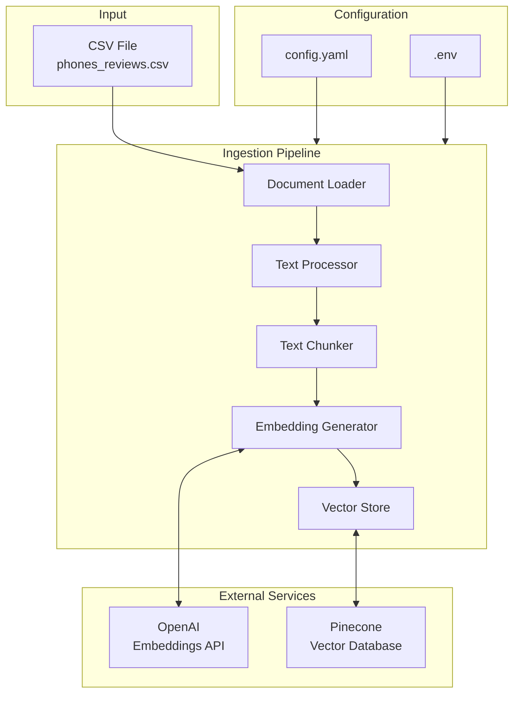

# Design Document: Data Ingestion Pipeline

## Overview

The Data Ingestion Pipeline transforms raw e-commerce product review data from CSV files into searchable vector embeddings stored in Pinecone. The pipeline follows a modular architecture with distinct components for loading, transformation, embedding generation, and storage, orchestrated by a central pipeline coordinator.

The design prioritizes:
- **Modularity**: Each component is independently testable and replaceable
- **Resilience**: Graceful error handling with detailed logging
- **Configurability**: External configuration for all tunable parameters
- **Scalability**: Batch processing for large datasets

## Architecture



## Components and Interfaces

### 1. Document Loader

Responsible for reading CSV files and returning structured data.

```python
from dataclasses import dataclass
from pathlib import Path
import pandas as pd
from typing import List

@dataclass
class LoaderConfig:
    file_path: Path
    encoding: str = "utf-8"
    required_columns: List[str] = None
    
    def __post_init__(self):
        if self.required_columns is None:
            self.required_columns = [
                "product_name", "description", "price", 
                "rating", "review_title", "review_text"
            ]

class DocumentLoader:
    """Loads and validates CSV data."""
    
    def __init__(self, config: LoaderConfig):
        self.config = config
    
    def load(self) -> pd.DataFrame:
        """Load CSV file and return validated DataFrame."""
        pass
    
    def _validate_file_exists(self) -> None:
        """Raise FileNotFoundError if file doesn't exist."""
        pass
    
    def _validate_columns(self, df: pd.DataFrame) -> None:
        """Raise ValidationError if required columns missing."""
        pass
    
    def _filter_empty_rows(self, df: pd.DataFrame) -> pd.DataFrame:
        """Remove empty rows and log warnings."""
        pass
```

### 2. Text Processor

Transforms raw DataFrame rows into LangChain Document objects.

```python
from langchain_core.documents import Document
from typing import List, Dict, Any
import pandas as pd

@dataclass
class ProcessorConfig:
    content_field: str = "review_text"
    metadata_fields: List[str] = None
    
    def __post_init__(self):
        if self.metadata_fields is None:
            self.metadata_fields = [
                "product_name", "description", "price", 
                "rating", "review_title"
            ]

class TextProcessor:
    """Transforms DataFrame rows into Document objects."""
    
    def __init__(self, config: ProcessorConfig):
        self.config = config
        self.skipped_records: List[Dict[str, Any]] = []
    
    def process(self, df: pd.DataFrame) -> List[Document]:
        """Convert DataFrame to list of Documents."""
        pass
    
    def _create_document(self, row: pd.Series) -> Document:
        """Create a single Document from a DataFrame row."""
        pass
    
    def _sanitize_metadata(self, row: pd.Series) -> Dict[str, Any]:
        """Replace NaN values with defaults."""
        pass
    
    def _is_valid_content(self, content: str) -> bool:
        """Check if content is non-empty and non-whitespace."""
        pass
    
    def get_validation_report(self) -> Dict[str, Any]:
        """Return summary of skipped records."""
        pass
```

### 3. Text Chunker

Splits large documents into smaller chunks for optimal embedding.

```python
from langchain.text_splitter import RecursiveCharacterTextSplitter
from langchain_core.documents import Document
from typing import List

@dataclass
class ChunkerConfig:
    chunk_size: int = 1000
    chunk_overlap: int = 200
    separators: List[str] = None
    
    def __post_init__(self):
        if self.separators is None:
            self.separators = ["\n\n", "\n", ". ", " ", ""]

class TextChunker:
    """Splits documents into smaller chunks."""
    
    def __init__(self, config: ChunkerConfig):
        self.config = config
        self.splitter = RecursiveCharacterTextSplitter(
            chunk_size=config.chunk_size,
            chunk_overlap=config.chunk_overlap,
            separators=config.separators
        )
    
    def chunk_documents(self, documents: List[Document]) -> List[Document]:
        """Split documents into chunks, preserving metadata."""
        pass
    
    def _needs_chunking(self, document: Document) -> bool:
        """Check if document exceeds chunk size."""
        pass
```

### 4. Embedding Generator

Generates vector embeddings using OpenAI.

```python
from langchain_openai import OpenAIEmbeddings
from langchain_core.documents import Document
from typing import List, Tuple
import numpy as np

@dataclass
class EmbeddingConfig:
    model_name: str = "text-embedding-3-large"
    api_key: str = None
    batch_size: int = 100
    expected_dimension: int = 3072

class EmbeddingGenerator:
    """Generates embeddings for documents."""
    
    def __init__(self, config: EmbeddingConfig):
        self.config = config
        self.embeddings_model = None
        self.failed_documents: List[Document] = []
    
    def initialize(self) -> None:
        """Initialize the embedding model."""
        pass
    
    def generate(self, documents: List[Document]) -> List[Tuple[Document, List[float]]]:
        """Generate embeddings for all documents."""
        pass
    
    def _generate_batch(self, batch: List[Document]) -> List[List[float]]:
        """Generate embeddings for a batch of documents."""
        pass
    
    def _validate_embedding(self, embedding: List[float]) -> bool:
        """Validate embedding dimension."""
        pass
```

### 5. Vector Store

Stores embeddings in Pinecone for similarity search.

```python
from pinecone import Pinecone, ServerlessSpec
from langchain_pinecone import PineconeVectorStore
from langchain_core.documents import Document
from typing import List, Tuple

@dataclass
class VectorStoreConfig:
    api_key: str
    index_name: str = "ecommerce-products"
    namespace: str = "phone-reviews"
    dimension: int = 3072
    metric: str = "cosine"
    cloud: str = "aws"
    region: str = "us-east-1"

class VectorStoreManager:
    """Manages Pinecone vector storage."""
    
    def __init__(self, config: VectorStoreConfig, embeddings_model):
        self.config = config
        self.embeddings_model = embeddings_model
        self.pc = None
        self.index = None
    
    def initialize(self) -> None:
        """Initialize Pinecone client and create index if needed."""
        pass
    
    def store_documents(self, documents: List[Document]) -> List[str]:
        """Store documents and return inserted IDs."""
        pass
    
    def _create_index_if_not_exists(self) -> None:
        """Create Pinecone index if it doesn't exist."""
        pass
    
    def _upsert_batch(self, documents: List[Document]) -> List[str]:
        """Upsert a batch of documents."""
        pass
```

### 6. Pipeline Orchestrator

Coordinates all components and manages the ingestion workflow.

```python
from dataclasses import dataclass
from typing import Dict, Any
import time

@dataclass
class PipelineConfig:
    loader_config: LoaderConfig
    processor_config: ProcessorConfig
    chunker_config: ChunkerConfig
    embedding_config: EmbeddingConfig
    vector_store_config: VectorStoreConfig
    abort_threshold: float = 0.5  # Abort if >50% records fail

class IngestionPipeline:
    """Orchestrates the complete ingestion workflow."""
    
    def __init__(self, config: PipelineConfig):
        self.config = config
        self.loader = DocumentLoader(config.loader_config)
        self.processor = TextProcessor(config.processor_config)
        self.chunker = TextChunker(config.chunker_config)
        self.embedding_generator = EmbeddingGenerator(config.embedding_config)
        self.vector_store = None  # Initialized after embedding model
        self.stats: Dict[str, Any] = {}
    
    def run(self) -> Dict[str, Any]:
        """Execute the complete pipeline."""
        pass
    
    def _load_stage(self) -> pd.DataFrame:
        """Execute loading stage."""
        pass
    
    def _transform_stage(self, df: pd.DataFrame) -> List[Document]:
        """Execute transformation stage."""
        pass
    
    def _chunk_stage(self, documents: List[Document]) -> List[Document]:
        """Execute chunking stage."""
        pass
    
    def _embed_stage(self, documents: List[Document]) -> None:
        """Execute embedding and storage stage."""
        pass
    
    def _check_data_quality(self, total: int, failed: int) -> None:
        """Abort if failure rate exceeds threshold."""
        pass
    
    def get_summary(self) -> Dict[str, Any]:
        """Return pipeline execution summary."""
        pass
```

## Data Models

### Product Review Schema

```python
from pydantic import BaseModel, Field, validator
from typing import Optional

class ProductReview(BaseModel):
    """Schema for product review data."""
    product_name: str = Field(..., description="Name of the product")
    description: str = Field(default="", description="Product description")
    price: Optional[float] = Field(default=None, description="Product price")
    rating: Optional[float] = Field(default=None, ge=1.0, le=5.0, description="Rating 1-5")
    review_title: str = Field(default="", description="Review title")
    review_text: str = Field(..., min_length=1, description="Review content")
    
    @validator('review_text')
    def review_not_empty(cls, v):
        if not v or v.strip() == "":
            raise ValueError("Review text cannot be empty")
        return v.strip()

class DocumentMetadata(BaseModel):
    """Metadata stored with each document in vector DB."""
    product_name: str
    description: str
    price: str  # Stored as string for Pinecone compatibility
    rating: str
    review_title: str
    chunk_index: Optional[int] = None
    total_chunks: Optional[int] = None
```

### Configuration Schema

```python
from pydantic import BaseSettings, Field
from typing import Optional

class IngestionSettings(BaseSettings):
    """Environment-based configuration."""
    
    # API Keys
    openai_api_key: str = Field(..., env="OPENAI_API_KEY")
    pinecone_api_key: str = Field(..., env="PINECONE_API_KEY")
    
    # Pinecone Settings
    pinecone_index_name: str = Field(default="ecommerce-products", env="PINECONE_INDEX_NAME")
    pinecone_namespace: str = Field(default="phone-reviews", env="PINECONE_NAMESPACE")
    
    # Embedding Settings
    embedding_model: str = Field(default="text-embedding-3-large")
    embedding_dimension: int = Field(default=3072)
    
    # Chunking Settings
    chunk_size: int = Field(default=1000)
    chunk_overlap: int = Field(default=200)
    
    # Pipeline Settings
    batch_size: int = Field(default=100)
    abort_threshold: float = Field(default=0.5)
    
    # Paths
    data_file_path: str = Field(default="data/phones_reviews.csv")
    log_dir: str = Field(default="logs")
    
    class Config:
        env_file = ".env"
        env_file_encoding = "utf-8"
```


## Correctness Properties

*A property is a characteristic or behavior that should hold true across all valid executions of a system—essentially, a formal statement about what the system should do. Properties serve as the bridge between human-readable specifications and machine-verifiable correctness guarantees.*

### Property 1: CSV Loading Round-Trip

*For any* valid CSV content with required columns, writing it to a file and loading it with Document_Loader SHALL produce a DataFrame with the same data (rows and columns preserved).

**Validates: Requirements 1.1**

### Property 2: Missing Columns Detection

*For any* CSV file missing one or more required columns, the Document_Loader SHALL raise a ValidationError that lists exactly the missing columns (no more, no less).

**Validates: Requirements 1.3**

### Property 3: Empty Row Filtering

*For any* CSV file containing N total rows where M rows are empty, the Document_Loader SHALL return a DataFrame with exactly (N - M) rows.

**Validates: Requirements 1.4**

### Property 4: Document Creation Preserves Data

*For any* valid product data row, the Text_Processor SHALL create a Document where:
- page_content equals the review_text field
- metadata contains all specified fields (product_name, description, price, rating, review_title)

**Validates: Requirements 2.1, 2.2**

### Property 5: NaN Value Replacement

*For any* product data row containing NaN values, the resulting Document metadata SHALL contain the appropriate defaults (empty string for text fields, "N/A" for numeric fields) instead of NaN.

**Validates: Requirements 2.3**

### Property 6: Whitespace Content Rejection

*For any* string composed entirely of whitespace characters (including empty string), when used as review_text, the Text_Processor SHALL skip that record and not include it in the output list.

**Validates: Requirements 2.4**

### Property 7: Chunking Behavior

*For any* Document:
- If page_content length > chunk_size: output SHALL be multiple chunks, each with length <= chunk_size, and all chunks SHALL have identical metadata to the original
- If page_content length <= chunk_size: output SHALL be a single Document with unchanged content

**Validates: Requirements 3.1, 3.2, 3.5**

### Property 8: Embedding Dimension Consistency

*For any* embedding generated by the Embedding_Generator, its dimension SHALL equal the configured expected_dimension (3072 for text-embedding-3-large).

**Validates: Requirements 9.3**

### Property 9: Storage Verification

*For any* batch of N documents stored in the Vector_Store:
- The return value SHALL contain exactly N document IDs
- Each stored document SHALL be retrievable with its original metadata intact

**Validates: Requirements 5.3, 5.4**

### Property 10: Missing Environment Variable Detection

*For any* set of environment variables where one or more required variables are missing, the configuration loader SHALL raise a ConfigurationError that lists exactly the missing variables.

**Validates: Requirements 7.3**

### Property 11: Validation Report Accuracy

*For any* pipeline execution where K records are skipped, the validation report SHALL contain exactly K entries, each with a reason for skipping.

**Validates: Requirements 9.4**

### Property 12: Data Quality Threshold Enforcement

*For any* dataset where the ratio of failed records to total records exceeds the abort_threshold (default 0.5), the Ingestion_Pipeline SHALL raise a DataQualityError before completing storage.

**Validates: Requirements 9.5**

### Property 13: Pipeline Summary Completeness

*For any* successful pipeline execution, the summary statistics SHALL contain: documents_loaded, documents_processed, documents_stored, and time_elapsed fields.

**Validates: Requirements 6.4**

## Error Handling

### Custom Exception Hierarchy

```python
class IngestionError(Exception):
    """Base exception for ingestion pipeline errors."""
    pass

class ValidationError(IngestionError):
    """Raised when data validation fails."""
    def __init__(self, message: str, details: dict = None):
        super().__init__(message)
        self.details = details or {}

class ConfigurationError(IngestionError):
    """Raised when configuration is invalid or missing."""
    def __init__(self, message: str, missing_keys: list = None):
        super().__init__(message)
        self.missing_keys = missing_keys or []

class ConnectionError(IngestionError):
    """Raised when external service connection fails."""
    def __init__(self, message: str, service: str = None):
        super().__init__(message)
        self.service = service

class DataQualityError(IngestionError):
    """Raised when data quality falls below threshold."""
    def __init__(self, message: str, failure_rate: float = None):
        super().__init__(message)
        self.failure_rate = failure_rate
```

### Error Handling Strategy

| Stage | Error Type | Handling |
|-------|-----------|----------|
| Loading | FileNotFoundError | Raise with file path |
| Loading | ValidationError | Raise with missing columns |
| Transform | Invalid content | Skip record, log warning |
| Embedding | API failure | Log error, continue with batch |
| Storage | Connection failure | Raise ConnectionError |
| Pipeline | >50% failures | Raise DataQualityError |

## Testing Strategy

### Testing Framework

- **Framework**: pytest with pytest-asyncio for async tests
- **Property Testing**: hypothesis for property-based tests
- **Mocking**: unittest.mock for external API mocking
- **Coverage**: pytest-cov with minimum 80% coverage target

### Unit Tests

Unit tests verify individual component behavior:

1. **DocumentLoader Tests**
   - Test valid CSV loading
   - Test FileNotFoundError for missing files
   - Test ValidationError for missing columns
   - Test empty row filtering

2. **TextProcessor Tests**
   - Test Document creation with all fields
   - Test NaN value replacement
   - Test whitespace content rejection
   - Test validation report generation

3. **TextChunker Tests**
   - Test chunking of large documents
   - Test metadata preservation
   - Test small document passthrough

4. **Configuration Tests**
   - Test YAML config loading
   - Test environment variable loading
   - Test missing variable detection
   - Test default value application

### Property-Based Tests

Property tests use hypothesis to generate random inputs:

```python
# Example property test structure
from hypothesis import given, strategies as st

@given(st.lists(st.text(min_size=1), min_size=1))
def test_document_creation_preserves_data(review_texts):
    """
    Feature: data-ingestion-pipeline, Property 4: Document Creation Preserves Data
    For any valid product data row, the resulting Document should have
    page_content equal to review_text and metadata containing all fields.
    """
    # Test implementation
    pass
```

**Property Test Configuration**:
- Minimum 100 iterations per property test
- Each test tagged with feature and property reference
- Custom strategies for generating valid product data

### Integration Tests

Integration tests verify component interactions:

1. **Pipeline Integration**
   - Test full pipeline with sample data
   - Test error propagation between stages
   - Test summary statistics accuracy

2. **External Service Integration**
   - Test Pinecone connection and storage (with test index)
   - Test embedding API integration (with mocked responses)

### Test Data

- **Sample CSV**: `tests/fixtures/sample_reviews.csv` with 10-20 records
- **Edge Cases**: Empty rows, NaN values, whitespace content, Unicode characters
- **Large Dataset**: `tests/fixtures/large_reviews.csv` for performance testing

### Test Commands

```bash
# Run all tests
uv run pytest tests/ -v

# Run with coverage
uv run pytest tests/ --cov=src/pipelines/ingestion --cov-report=html

# Run property tests only
uv run pytest tests/ -v -m "property"

# Run specific component tests
uv run pytest tests/unit/test_document_loader.py -v
```
