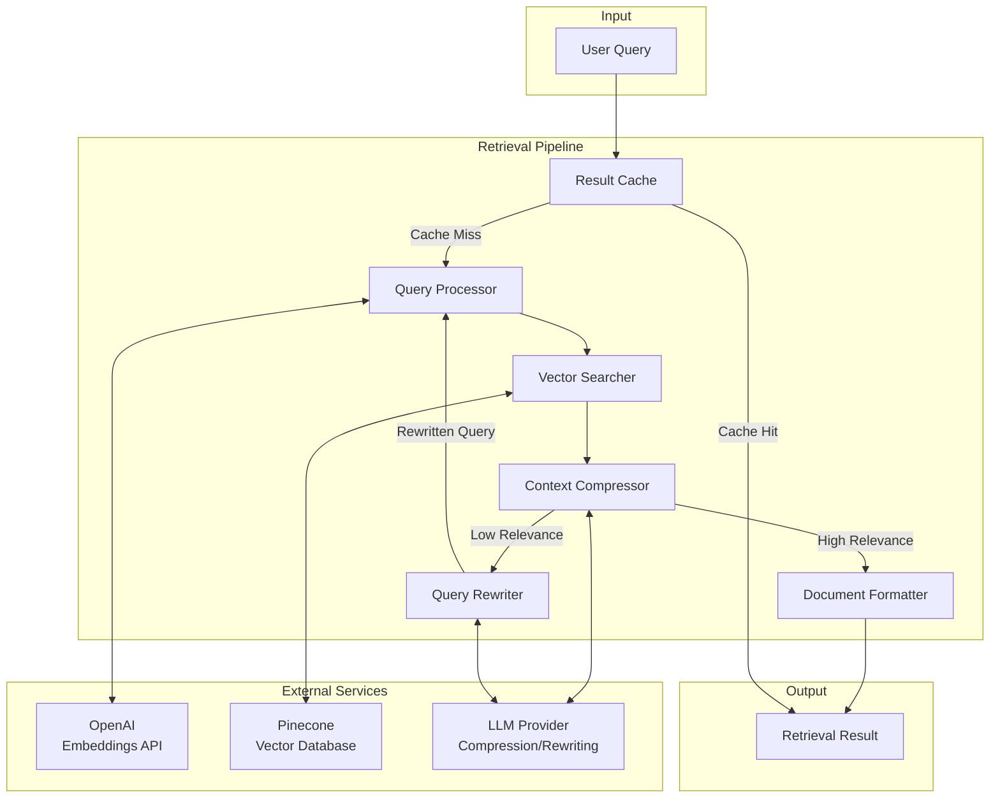

# Design Document: Data Retrieval Pipeline

## Overview

The Data Retrieval Pipeline implements advanced RAG (Retrieval-Augmented Generation) techniques to fetch relevant product information from Pinecone based on user queries. The pipeline combines semantic search with MMR diversity, LLM-based contextual compression, and query rewriting to deliver high-quality, relevant context for the inference pipeline.

The design prioritizes:
- **Relevance**: Multi-stage filtering ensures only relevant documents reach the LLM
- **Diversity**: MMR prevents redundant results
- **Resilience**: Retry logic and graceful degradation for failures
- **Performance**: Caching and async support for low latency

## Architecture



## Components and Interfaces

### 1. Query Processor

Handles query validation, normalization, and embedding generation.

```python
from dataclasses import dataclass
from typing import List, Optional
import numpy as np

@dataclass
class QueryConfig:
    max_length: int = 512
    embedding_model: str = "text-embedding-3-large"
    normalize_unicode: bool = True

@dataclass
class ProcessedQuery:
    original: str
    normalized: str
    embedding: List[float]
    truncated: bool = False

class QueryProcessor:
    """Processes and embeds user queries."""
    
    def __init__(self, config: QueryConfig, embeddings_model):
        self.config = config
        self.embeddings_model = embeddings_model
    
    def process(self, query: str) -> ProcessedQuery:
        """Process query: validate, normalize, and embed."""
        pass
    
    def _validate(self, query: str) -> None:
        """Raise ValidationError if query is invalid."""
        pass
    
    def _normalize(self, query: str) -> str:
        """Normalize whitespace and unicode."""
        pass
    
    def _truncate(self, query: str) -> tuple[str, bool]:
        """Truncate if exceeds max length, return (text, was_truncated)."""
        pass
    
    def _embed(self, text: str) -> List[float]:
        """Generate embedding vector for text."""
        pass
```

### 2. Vector Searcher

Performs similarity search with MMR and metadata filtering.

```python
from dataclasses import dataclass, field
from typing import List, Dict, Any, Optional
from langchain_core.documents import Document

@dataclass
class SearchConfig:
    top_k: int = 4
    fetch_k: int = 20
    lambda_mult: float = 0.7
    score_threshold: float = 0.6
    search_type: str = "mmr"  # "similarity" or "mmr"

@dataclass
class MetadataFilter:
    min_price: Optional[float] = None
    max_price: Optional[float] = None
    min_rating: Optional[float] = None
    product_name_pattern: Optional[str] = None

@dataclass
class SearchResult:
    documents: List[Document]
    scores: List[float]
    query_embedding: List[float]
    filters_applied: Dict[str, Any] = field(default_factory=dict)

class VectorSearcher:
    """Performs vector similarity search against Pinecone."""
    
    def __init__(self, config: SearchConfig, vector_store):
        self.config = config
        self.vector_store = vector_store
        self.retriever = None
    
    def initialize(self) -> None:
        """Initialize the retriever with configured settings."""
        pass
    
    def search(
        self, 
        query_embedding: List[float],
        filters: Optional[MetadataFilter] = None
    ) -> SearchResult:
        """Perform similarity search with optional filters."""
        pass
    
    def _build_filter_dict(self, filters: MetadataFilter) -> Dict[str, Any]:
        """Convert MetadataFilter to Pinecone filter format."""
        pass
    
    def _apply_score_threshold(
        self, 
        documents: List[Document], 
        scores: List[float]
    ) -> tuple[List[Document], List[float]]:
        """Filter results below score threshold."""
        pass
```

### 3. Context Compressor

Filters documents for relevance using LLM-based evaluation.

```python
from dataclasses import dataclass
from typing import List, Tuple
from langchain_core.documents import Document
from langchain.retrievers.document_compressors import LLMChainFilter
from langchain.retrievers import ContextualCompressionRetriever

@dataclass
class CompressorConfig:
    enabled: bool = True
    relevance_prompt: str = None  # Custom prompt for relevance evaluation

@dataclass
class CompressionResult:
    documents: List[Document]
    filtered_count: int
    relevance_scores: List[float]

class ContextCompressor:
    """Filters documents for relevance using LLM."""
    
    def __init__(self, config: CompressorConfig, llm):
        self.config = config
        self.llm = llm
        self.compressor = None
    
    def initialize(self) -> None:
        """Initialize the LLM chain filter."""
        pass
    
    def compress(
        self, 
        query: str, 
        documents: List[Document]
    ) -> CompressionResult:
        """Filter documents based on relevance to query."""
        pass
    
    def _evaluate_relevance(
        self, 
        query: str, 
        document: Document
    ) -> Tuple[bool, float]:
        """Evaluate if document is relevant to query."""
        pass
```

### 4. Query Rewriter

Reformulates queries for better retrieval results.

```python
from dataclasses import dataclass
from typing import Optional

@dataclass
class RewriterConfig:
    max_attempts: int = 2
    relevance_threshold: float = 0.5  # Trigger rewrite below this
    rewrite_prompt: str = None  # Custom rewrite prompt

@dataclass
class RewriteResult:
    original_query: str
    rewritten_query: str
    attempt_number: int
    improvement_reason: str

class QueryRewriter:
    """Rewrites queries for improved retrieval."""
    
    def __init__(self, config: RewriterConfig, llm):
        self.config = config
        self.llm = llm
    
    def should_rewrite(self, relevance_score: float) -> bool:
        """Determine if query should be rewritten based on score."""
        pass
    
    def rewrite(
        self, 
        query: str, 
        context: Optional[str] = None
    ) -> RewriteResult:
        """Generate improved version of query."""
        pass
    
    def _generate_rewrite(self, query: str, context: str) -> str:
        """Use LLM to rewrite the query."""
        pass
```

### 5. Document Formatter

Formats retrieved documents into structured context.

```python
from dataclasses import dataclass
from typing import List, Optional
from langchain_core.documents import Document

@dataclass
class FormatterConfig:
    template: str = None  # Custom format template
    delimiter: str = "\n\n---\n\n"
    include_scores: bool = False
    max_context_length: int = 4000

@dataclass
class FormattedContext:
    text: str
    document_count: int
    truncated: bool = False

class DocumentFormatter:
    """Formats documents into structured context string."""
    
    DEFAULT_TEMPLATE = """Title: {product_name}
Price: {price}
Rating: {rating}
Review: {review_text}"""
    
    def __init__(self, config: FormatterConfig):
        self.config = config
    
    def format(
        self, 
        documents: List[Document],
        scores: Optional[List[float]] = None
    ) -> FormattedContext:
        """Format documents into context string."""
        pass
    
    def _format_single(
        self, 
        document: Document, 
        score: Optional[float] = None
    ) -> str:
        """Format a single document."""
        pass
    
    def _get_metadata_value(
        self, 
        document: Document, 
        key: str
    ) -> str:
        """Get metadata value with N/A fallback."""
        pass
```

### 6. Result Cache

Caches retrieval results for repeated queries.

```python
from dataclasses import dataclass
from typing import Optional, Dict, Any
from datetime import datetime, timedelta
import hashlib

@dataclass
class CacheConfig:
    enabled: bool = True
    ttl_seconds: int = 300  # 5 minutes
    max_size: int = 1000

@dataclass
class CacheEntry:
    result: 'RetrievalResult'
    created_at: datetime
    hits: int = 0

class ResultCache:
    """LRU cache for retrieval results."""
    
    def __init__(self, config: CacheConfig):
        self.config = config
        self._cache: Dict[str, CacheEntry] = {}
    
    def get(self, query: str, filters: Optional[Dict] = None) -> Optional['RetrievalResult']:
        """Get cached result if exists and not expired."""
        pass
    
    def set(self, query: str, result: 'RetrievalResult', filters: Optional[Dict] = None) -> None:
        """Cache a retrieval result."""
        pass
    
    def _generate_key(self, query: str, filters: Optional[Dict]) -> str:
        """Generate cache key from query and filters."""
        pass
    
    def _is_expired(self, entry: CacheEntry) -> bool:
        """Check if cache entry has expired."""
        pass
    
    def _evict_oldest(self) -> None:
        """Remove oldest entries when cache is full."""
        pass
    
    def clear(self) -> None:
        """Clear all cached entries."""
        pass
```

### 7. Retrieval Pipeline Orchestrator

Coordinates all components for end-to-end retrieval.

```python
from dataclasses import dataclass, field
from typing import Optional, Dict, Any, List
from datetime import datetime
import asyncio
import logging

@dataclass
class RetrievalConfig:
    query_config: QueryConfig
    search_config: SearchConfig
    compressor_config: CompressorConfig
    rewriter_config: RewriterConfig
    formatter_config: FormatterConfig
    cache_config: CacheConfig
    max_retries: int = 3
    enable_evaluation: bool = False

@dataclass
class RetrievalResult:
    query: str
    documents: List[Document]
    formatted_context: str
    scores: List[float]
    metadata: Dict[str, Any] = field(default_factory=dict)
    latency_ms: float = 0.0
    from_cache: bool = False
    evaluation_scores: Optional[Dict[str, float]] = None

class RetrievalPipeline:
    """Orchestrates the complete retrieval workflow."""
    
    def __init__(self, config: RetrievalConfig):
        self.config = config
        self.query_processor = None
        self.vector_searcher = None
        self.context_compressor = None
        self.query_rewriter = None
        self.document_formatter = None
        self.cache = None
        self.evaluator = None
        self.logger = logging.getLogger(__name__)
    
    def initialize(self) -> None:
        """Initialize all pipeline components."""
        pass
    
    def retrieve(
        self, 
        query: str,
        filters: Optional[MetadataFilter] = None
    ) -> RetrievalResult:
        """Execute synchronous retrieval."""
        pass
    
    async def aretrieve(
        self, 
        query: str,
        filters: Optional[MetadataFilter] = None
    ) -> RetrievalResult:
        """Execute asynchronous retrieval."""
        pass
    
    def _execute_with_retry(
        self, 
        func, 
        *args, 
        **kwargs
    ) -> Any:
        """Execute function with retry logic."""
        pass
    
    def _evaluate_results(
        self, 
        query: str, 
        result: RetrievalResult
    ) -> Dict[str, float]:
        """Compute RAGAS evaluation metrics."""
        pass

### 8. RAGAS Evaluation Component

Evaluates retrieval quality using RAGAS metrics.

```python
from dataclasses import dataclass
from typing import List, Dict, Any, Optional
from ragas import evaluate
from ragas.metrics import context_precision, answer_relevancy
import pandas as pd

@dataclass
class EvaluationConfig:
    enabled: bool = False
    metrics: List[str] = field(default_factory=lambda: ["context_precision", "answer_relevancy"])
    batch_size: int = 10

@dataclass
class EvaluationResult:
    context_precision: Optional[float] = None
    answer_relevancy: Optional[float] = None
    metadata: Dict[str, Any] = field(default_factory=dict)

class RAGASEvaluator:
    """Evaluates retrieval quality using RAGAS framework."""
    
    def __init__(self, config: EvaluationConfig, llm):
        self.config = config
        self.llm = llm
        self.metrics_map = {
            "context_precision": context_precision,
            "answer_relevancy": answer_relevancy
        }
    
    def evaluate_single(
        self, 
        query: str, 
        contexts: List[str],
        answer: Optional[str] = None
    ) -> EvaluationResult:
        """Evaluate a single query-context pair."""
        if not self.config.enabled:
            return EvaluationResult()
        
        try:
            # Prepare data for RAGAS
            data = {
                "question": [query],
                "contexts": [contexts],
            }
            
            if answer:
                data["answer"] = [answer]
            
            dataset = pd.DataFrame(data)
            
            # Select metrics to compute
            metrics = [self.metrics_map[m] for m in self.config.metrics 
                      if m in self.metrics_map]
            
            # Run evaluation
            result = evaluate(dataset, metrics=metrics, llm=self.llm)
            
            return EvaluationResult(
                context_precision=result.get("context_precision"),
                answer_relevancy=result.get("answer_relevancy"),
                metadata={"evaluation_time": datetime.utcnow().isoformat()}
            )
            
        except Exception as e:
            self.logger.warning(f"Evaluation failed: {str(e)}")
            return EvaluationResult(
                metadata={"error": str(e)}
            )
    
    def batch_evaluate(
        self, 
        queries: List[str],
        contexts_list: List[List[str]],
        answers: Optional[List[str]] = None
    ) -> List[EvaluationResult]:
        """Evaluate multiple query-context pairs in batch."""
        if not self.config.enabled:
            return [EvaluationResult() for _ in queries]
        
        results = []
        for i in range(0, len(queries), self.config.batch_size):
            batch_queries = queries[i:i + self.config.batch_size]
            batch_contexts = contexts_list[i:i + self.config.batch_size]
            batch_answers = answers[i:i + self.config.batch_size] if answers else None
            
            for j, query in enumerate(batch_queries):
                contexts = batch_contexts[j]
                answer = batch_answers[j] if batch_answers else None
                result = self.evaluate_single(query, contexts, answer)
                results.append(result)
        
        return results
```

## Data Models

### Retrieval Result Schema

```python
from pydantic import BaseModel, Field
from typing import List, Dict, Any, Optional
from datetime import datetime

class DocumentScore(BaseModel):
    """Document with its similarity score."""
    content: str
    metadata: Dict[str, Any]
    score: float = Field(ge=0.0, le=1.0)

class RetrievalMetadata(BaseModel):
    """Metadata about the retrieval operation."""
    query_normalized: str
    query_truncated: bool = False
    filters_applied: Dict[str, Any] = {}
    documents_fetched: int
    documents_after_compression: int
    query_rewritten: bool = False
    rewrite_attempts: int = 0
    cache_hit: bool = False

class EvaluationScores(BaseModel):
    """RAGAS evaluation scores."""
    context_precision: Optional[float] = Field(None, ge=0.0, le=1.0)
    answer_relevancy: Optional[float] = Field(None, ge=0.0, le=1.0)
    evaluation_time_ms: Optional[float] = Field(None, ge=0.0)
    error: Optional[str] = None

class RetrievalResponse(BaseModel):
    """Complete retrieval response."""
    query: str
    documents: List[DocumentScore]
    formatted_context: str
    metadata: RetrievalMetadata
    evaluation: Optional[EvaluationScores] = None
    latency_ms: float
    timestamp: datetime = Field(default_factory=datetime.utcnow)
```

### Configuration Schema

```python
from pydantic import BaseSettings, Field
from typing import Optional, Dict, Any
import yaml
from pathlib import Path

class RetrievalSettings(BaseSettings):
    """Environment-based configuration for retrieval."""
    
    # API Keys (from environment only)
    openai_api_key: str = Field(..., env="OPENAI_API_KEY")
    pinecone_api_key: str = Field(..., env="PINECONE_API_KEY")
    
    # Pinecone Settings
    pinecone_index_name: str = Field(default="ecommerce-products", env="PINECONE_INDEX_NAME")
    pinecone_namespace: str = Field(default="phone-reviews", env="PINECONE_NAMESPACE")
    
    # Search Settings
    top_k: int = Field(default=4)
    fetch_k: int = Field(default=20)
    lambda_mult: float = Field(default=0.7)
    score_threshold: float = Field(default=0.6)
    
    # Query Settings
    max_query_length: int = Field(default=512)
    
    # Compression Settings
    compression_enabled: bool = Field(default=True)
    
    # Rewriter Settings
    max_rewrite_attempts: int = Field(default=2)
    rewrite_threshold: float = Field(default=0.5)
    
    # Cache Settings
    cache_enabled: bool = Field(default=True)
    cache_ttl_seconds: int = Field(default=300)
    
    # Retry Settings
    max_retries: int = Field(default=3)
    
    # Evaluation Settings
    enable_evaluation: bool = Field(default=False)
    
    class Config:
        env_file = ".env"
        env_file_encoding = "utf-8"

class ConfigurationLoader:
    """Loads configuration from YAML files and environment variables."""
    
    def __init__(self, config_path: Optional[str] = None):
        self.config_path = config_path or "config/retrieval.yaml"
    
    def load_config(self) -> RetrievalSettings:
        """Load configuration from YAML file and environment variables."""
        yaml_config = self._load_yaml_config()
        
        # Merge YAML config with environment variables
        # Environment variables take precedence
        merged_config = {**yaml_config}
        
        try:
            return RetrievalSettings(**merged_config)
        except Exception as e:
            missing_keys = self._extract_missing_keys(e)
            raise ConfigurationError(
                f"Configuration validation failed: {str(e)}", 
                missing_keys=missing_keys
            )
    
    def _load_yaml_config(self) -> Dict[str, Any]:
        """Load configuration from YAML file."""
        config_file = Path(self.config_path)
        if not config_file.exists():
            return {}  # Use defaults if no config file
        
        try:
            with open(config_file, 'r') as f:
                return yaml.safe_load(f) or {}
        except yaml.YAMLError as e:
            raise ConfigurationError(f"Invalid YAML configuration: {str(e)}")
    
    def _extract_missing_keys(self, error: Exception) -> List[str]:
        """Extract missing required keys from validation error."""
        # Parse Pydantic validation error to extract missing fields
        missing_keys = []
        error_str = str(error)
        if "field required" in error_str:
            # Extract field names from error message
            import re
            matches = re.findall(r"(\w+)\s*\n.*field required", error_str)
            missing_keys.extend(matches)
        return missing_keys

# Example YAML Configuration File (config/retrieval.yaml)
"""
# Retrieval Pipeline Configuration
search:
  top_k: 4
  fetch_k: 20
  lambda_mult: 0.7
  score_threshold: 0.6

query:
  max_query_length: 512

compression:
  enabled: true

rewriter:
  max_rewrite_attempts: 2
  rewrite_threshold: 0.5

cache:
  enabled: true
  ttl_seconds: 300
  max_size: 1000

retry:
  max_retries: 3

evaluation:
  enabled: false
  metrics:
    - context_precision
    - answer_relevancy
  batch_size: 10

logging:
  level: INFO
  structured: true
"""
```


## Correctness Properties

*A property is a characteristic or behavior that should hold true across all valid executions of a system—essentially, a formal statement about what the system should do. Properties serve as the bridge between human-readable specifications and machine-verifiable correctness guarantees.*

### Property 1: Query Normalization and Truncation

*For any* query string:
- The normalized output SHALL have leading/trailing whitespace removed
- If the query length exceeds max_length, the output SHALL be truncated to exactly max_length characters
- The ProcessedQuery.truncated flag SHALL be True if and only if truncation occurred

**Validates: Requirements 1.1, 1.5**

### Property 2: Empty Query Rejection

*For any* string composed entirely of whitespace characters (including empty string), the Query_Processor SHALL raise a ValidationError.

**Validates: Requirements 1.2**

### Property 3: Query Embedding Dimension

*For any* valid (non-empty) query, the generated embedding SHALL have exactly the expected dimension (3072 for text-embedding-3-large).

**Validates: Requirements 1.3**

### Property 4: Search Result Constraints

*For any* vector search operation:
- The number of returned documents SHALL be <= top_k
- All returned documents SHALL have similarity scores >= score_threshold
- The documents list and scores list SHALL have equal length

**Validates: Requirements 2.2, 2.5, 2.6**

### Property 5: Metadata Filter Enforcement

*For any* search with metadata filters applied:
- If min_price is set, all returned documents SHALL have price >= min_price
- If max_price is set, all returned documents SHALL have price <= max_price
- If min_rating is set, all returned documents SHALL have rating >= min_rating

**Validates: Requirements 3.1, 3.3, 3.4**

### Property 6: Compression Preserves Metadata

*For any* document that passes through the Context_Compressor:
- The output document count SHALL be <= input document count
- Each output document SHALL have identical metadata to its corresponding input document

**Validates: Requirements 4.3, 4.4**

### Property 7: Rewrite Trigger and Constraints

*For any* retrieval operation:
- Query rewriting SHALL be triggered if and only if relevance_score < rewrite_threshold
- The number of rewrite attempts SHALL never exceed max_attempts
- The RewriteResult SHALL contain both original_query and rewritten_query fields

**Validates: Requirements 5.1, 5.4, 5.5**

### Property 8: Document Formatting Completeness

*For any* list of N documents formatted by Document_Formatter:
- The output string SHALL contain product_name, price, rating, and review content for each document
- The output SHALL contain exactly (N-1) delimiter occurrences
- For any document with missing metadata, the output SHALL show "N/A" for that field

**Validates: Requirements 6.1, 6.2, 6.3, 6.4**

### Property 9: Retrieval Result Structure

*For any* successful retrieval operation, the RetrievalResult SHALL contain:
- query (original query string)
- documents (list of retrieved documents)
- formatted_context (formatted string)
- scores (list of similarity scores)
- metadata (operation metadata)
- latency_ms (execution time)

**Validates: Requirements 7.3**

### Property 10: Cache Hit for Repeated Queries

*For any* query Q executed twice within cache TTL:
- The second execution SHALL return from_cache=True
- The second execution SHALL return identical documents to the first

**Validates: Requirements 7.4**

### Property 11: Missing Environment Variable Detection

*For any* set of environment variables where one or more required variables are missing, the configuration loader SHALL raise a ConfigurationError listing exactly the missing variables.

**Validates: Requirements 8.3**

### Property 12: Retry Logic Enforcement

*For any* transient failure during retrieval:
- The pipeline SHALL retry up to max_retries times
- The total attempt count SHALL be <= (max_retries + 1)

**Validates: Requirements 9.4**

### Property 13: Evaluation Scores Inclusion

*For any* retrieval operation with enable_evaluation=True, the RetrievalResult.evaluation_scores SHALL contain context_precision and response_relevancy fields.

**Validates: Requirements 10.5**

## Error Handling

### Custom Exception Hierarchy

```python
class RetrievalError(Exception):
    """Base exception for retrieval pipeline errors."""
    pass

class QueryValidationError(RetrievalError):
    """Raised when query validation fails."""
    def __init__(self, message: str, query: str = None):
        super().__init__(message)
        self.query = query

class EmbeddingError(RetrievalError):
    """Raised when embedding generation fails."""
    def __init__(self, message: str, query: str = None):
        super().__init__(message)
        self.query = query

class SearchError(RetrievalError):
    """Raised when vector search fails."""
    def __init__(self, message: str, details: dict = None):
        super().__init__(message)
        self.details = details or {}

class ConnectionError(RetrievalError):
    """Raised when external service connection fails."""
    def __init__(self, message: str, service: str = None):
        super().__init__(message)
        self.service = service

class ConfigurationError(RetrievalError):
    """Raised when configuration is invalid or missing."""
    def __init__(self, message: str, missing_keys: list = None):
        super().__init__(message)
        self.missing_keys = missing_keys or []
```

### Structured Logging Integration

The pipeline integrates with the project's centralized logging system defined in `config/logging.yaml`:

```python
import logging
import structlog
from typing import Dict, Any
import time

class RetrievalLogger:
    """Structured logger for retrieval pipeline operations."""
    
    def __init__(self, component_name: str):
        self.logger = structlog.get_logger(component_name)
        self.component = component_name
    
    def log_query_processing(
        self, 
        query: str, 
        processing_time_ms: float,
        truncated: bool = False
    ) -> None:
        """Log query processing metrics."""
        self.logger.info(
            "query_processed",
            component=self.component,
            query_length=len(query),
            processing_time_ms=processing_time_ms,
            truncated=truncated
        )
    
    def log_search_results(
        self, 
        query: str,
        results_count: int,
        search_time_ms: float,
        filters_applied: Dict[str, Any] = None
    ) -> None:
        """Log vector search results."""
        self.logger.info(
            "search_completed",
            component=self.component,
            query_hash=hash(query) % 10000,  # Anonymized query identifier
            results_count=results_count,
            search_time_ms=search_time_ms,
            filters_applied=filters_applied or {}
        )
    
    def log_compression_results(
        self, 
        input_count: int,
        output_count: int,
        compression_time_ms: float
    ) -> None:
        """Log contextual compression results."""
        self.logger.info(
            "compression_completed",
            component=self.component,
            input_documents=input_count,
            output_documents=output_count,
            filtered_count=input_count - output_count,
            compression_time_ms=compression_time_ms
        )
    
    def log_cache_operation(
        self, 
        operation: str,  # "hit" or "miss" or "set"
        query_hash: str,
        cache_size: int = None
    ) -> None:
        """Log cache operations."""
        self.logger.info(
            "cache_operation",
            component=self.component,
            operation=operation,
            query_hash=query_hash,
            cache_size=cache_size
        )
    
    def log_error(
        self, 
        error: Exception,
        context: Dict[str, Any] = None
    ) -> None:
        """Log errors with context."""
        self.logger.error(
            "retrieval_error",
            component=self.component,
            error_type=type(error).__name__,
            error_message=str(error),
            context=context or {}
        )
    
    def log_evaluation_metrics(
        self, 
        metrics: Dict[str, float],
        evaluation_time_ms: float
    ) -> None:
        """Log RAGAS evaluation metrics."""
        self.logger.info(
            "evaluation_completed",
            component=self.component,
            **metrics,
            evaluation_time_ms=evaluation_time_ms
        )

# Performance monitoring decorator
def log_performance(operation_name: str):
    """Decorator to log operation performance metrics."""
    def decorator(func):
        def wrapper(self, *args, **kwargs):
            start_time = time.time()
            try:
                result = func(self, *args, **kwargs)
                duration_ms = (time.time() - start_time) * 1000
                
                if hasattr(self, 'logger'):
                    self.logger.log_performance(
                        operation=operation_name,
                        duration_ms=duration_ms,
                        success=True
                    )
                return result
            except Exception as e:
                duration_ms = (time.time() - start_time) * 1000
                if hasattr(self, 'logger'):
                    self.logger.log_performance(
                        operation=operation_name,
                        duration_ms=duration_ms,
                        success=False,
                        error=str(e)
                    )
                raise
        return wrapper
    return decorator
```

### Error Handling Strategy

| Component | Error Type | Handling |
|-----------|-----------|----------|
| Query Processor | Empty query | Raise QueryValidationError |
| Query Processor | Embedding failure | Raise EmbeddingError, include query |
| Vector Searcher | Pinecone connection | Retry, then raise ConnectionError |
| Vector Searcher | No results | Return empty SearchResult |
| Context Compressor | LLM failure | Log warning, return uncompressed |
| Query Rewriter | LLM failure | Log warning, use original query |
| Cache | Cache miss | Proceed with retrieval |
| Pipeline | All retries exhausted | Return empty result with error metadata |

### Retry Configuration

```python
@dataclass
class RetryConfig:
    max_retries: int = 3
    base_delay: float = 1.0  # seconds
    max_delay: float = 10.0  # seconds
    exponential_base: float = 2.0
    retryable_exceptions: tuple = (ConnectionError, TimeoutError)
```

## Testing Strategy

### Testing Framework

- **Framework**: pytest with pytest-asyncio for async tests
- **Property Testing**: hypothesis for property-based tests
- **Mocking**: unittest.mock for external API mocking
- **Coverage**: pytest-cov with minimum 80% coverage target
- **Dependencies**: 
  - `ragas` for evaluation metrics
  - `langchain` for document processing and LLM integration
  - `pinecone-client` for vector database operations
  - `openai` for embeddings API
  - `structlog` for structured logging
  - `pydantic` for data validation
  - `pyyaml` for configuration loading

### Unit Tests

Unit tests verify individual component behavior:

1. **QueryProcessor Tests**
   - Test query normalization (whitespace, unicode)
   - Test empty query rejection
   - Test truncation behavior
   - Test embedding generation (mocked)

2. **VectorSearcher Tests**
   - Test search result count <= top_k
   - Test score threshold filtering
   - Test metadata filter application
   - Test MMR vs similarity search

3. **ContextCompressor Tests**
   - Test document filtering
   - Test metadata preservation
   - Test compression with mocked LLM

4. **QueryRewriter Tests**
   - Test rewrite trigger conditions
   - Test max attempts enforcement
   - Test result structure

5. **DocumentFormatter Tests**
   - Test formatting with all fields
   - Test N/A placeholder for missing fields
   - Test delimiter placement

6. **ResultCache Tests**
   - Test cache hit/miss behavior
   - Test TTL expiration
   - Test cache key generation

### Property-Based Tests

Property tests use hypothesis to generate random inputs:

```python
from hypothesis import given, strategies as st

@given(st.text(min_size=1).filter(lambda x: x.strip()))
def test_query_embedding_dimension(query):
    """
    Feature: data-retrieval-pipeline, Property 3: Query Embedding Dimension
    For any valid query, the embedding should have the expected dimension.
    """
    # Test implementation
    pass

@given(st.lists(st.fixed_dictionaries({
    'content': st.text(min_size=1),
    'price': st.floats(min_value=0, max_value=10000),
    'rating': st.floats(min_value=1, max_value=5)
}), min_size=1, max_size=10))
def test_metadata_filter_enforcement(documents):
    """
    Feature: data-retrieval-pipeline, Property 5: Metadata Filter Enforcement
    All returned documents should satisfy the filter criteria.
    """
    # Test implementation
    pass
```

**Property Test Configuration**:
- Minimum 100 iterations per property test
- Each test tagged with feature and property reference
- Custom strategies for generating valid queries and documents

### Integration Tests

Integration tests verify component interactions:

1. **Pipeline Integration**
   - Test full retrieval flow with sample queries
   - Test caching behavior across calls
   - Test retry logic with simulated failures

2. **External Service Integration**
   - Test Pinecone connection and search (with test index)
   - Test embedding API integration (with mocked responses)
   - Test LLM integration for compression/rewriting

### Test Commands

```bash
# Run all tests
uv run pytest tests/unit/test_retrieval/ -v

# Run with coverage
uv run pytest tests/ --cov=src/pipelines/retrieval --cov-report=html

# Run property tests only
uv run pytest tests/ -v -m "property"

# Run async tests
uv run pytest tests/ -v -m "asyncio"
```
