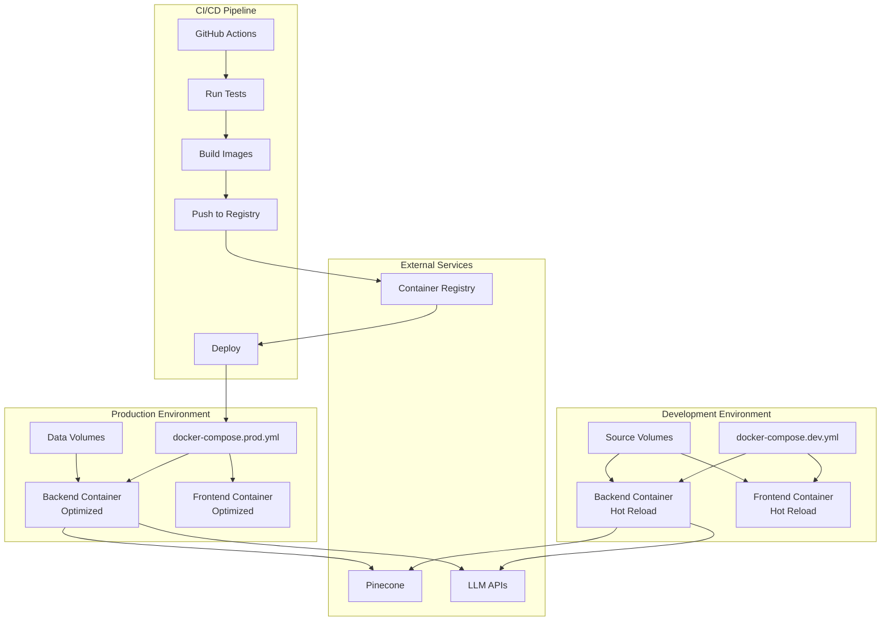

# Design Document: Deployment and DevOps

## Overview

The Deployment and DevOps infrastructure provides containerization, orchestration, and deployment automation for the Conversational RAG E-commerce Application. The design uses Docker for containerization, Docker Compose for local orchestration, and GitHub Actions for CI/CD. Separate configurations support development and production environments with comprehensive logging and health monitoring.

The design prioritizes:
- **Consistency**: Same containers across all environments
- **Security**: Non-root containers, secrets management, minimal images
- **Observability**: Structured logging, health checks, metrics
- **Automation**: CI/CD pipelines, deployment scripts

## Architecture



## Components and Interfaces

### 1. Backend Dockerfile

Multi-stage Dockerfile for FastAPI backend.

```dockerfile
# Dockerfile.backend
# Stage 1: Builder
FROM python:3.11-slim as builder

WORKDIR /app

# Install build dependencies
RUN apt-get update && apt-get install -y --no-install-recommends \
    build-essential \
    && rm -rf /var/lib/apt/lists/*

# Install Python dependencies
COPY requirements.txt .
RUN pip install --no-cache-dir --user -r requirements.txt

# Stage 2: Production
FROM python:3.11-slim as production

WORKDIR /app

# Create non-root user
RUN groupadd -r appgroup && useradd -r -g appgroup appuser

# Copy Python packages from builder
COPY --from=builder /root/.local /home/appuser/.local

# Copy application code
COPY src/ ./src/
COPY config/ ./config/

# Set environment
ENV PATH=/home/appuser/.local/bin:$PATH
ENV PYTHONPATH=/app
ENV PYTHONUNBUFFERED=1

# Switch to non-root user
USER appuser

# Health check
HEALTHCHECK --interval=30s --timeout=10s --start-period=5s --retries=3 \
    CMD python -c "import httpx; httpx.get('http://localhost:8000/health')" || exit 1

# Expose port
EXPOSE 8000

# Run application
CMD ["uvicorn", "src.api.main:app", "--host", "0.0.0.0", "--port", "8000"]

# Stage 3: Development
FROM production as development

USER root

# Install development dependencies
RUN pip install --no-cache-dir watchfiles

USER appuser

# Run with hot reload
CMD ["uvicorn", "src.api.main:app", "--host", "0.0.0.0", "--port", "8000", "--reload"]
```

### 2. Frontend Dockerfile

Multi-stage Dockerfile for Streamlit frontend.

```dockerfile
# Dockerfile.frontend
# Stage 1: Builder
FROM python:3.11-slim as builder

WORKDIR /app

COPY requirements.txt .
RUN pip install --no-cache-dir --user -r requirements.txt

# Stage 2: Production
FROM python:3.11-slim as production

WORKDIR /app

# Create non-root user
RUN groupadd -r appgroup && useradd -r -g appgroup appuser

# Copy Python packages from builder
COPY --from=builder /root/.local /home/appuser/.local

# Copy application code
COPY src/frontend/ ./src/frontend/

# Set environment
ENV PATH=/home/appuser/.local/bin:$PATH
ENV PYTHONPATH=/app
ENV PYTHONUNBUFFERED=1

# Switch to non-root user
USER appuser

# Health check
HEALTHCHECK --interval=30s --timeout=10s --start-period=5s --retries=3 \
    CMD python -c "import httpx; httpx.get('http://localhost:8501/healthz')" || exit 1

# Expose port
EXPOSE 8501

# Run application
CMD ["streamlit", "run", "src/frontend/app.py", "--server.port=8501", "--server.address=0.0.0.0"]

# Stage 3: Development
FROM production as development

# Run with file watcher
CMD ["streamlit", "run", "src/frontend/app.py", "--server.port=8501", "--server.address=0.0.0.0", "--server.runOnSave=true"]
```

### 3. Docker Compose - Development

```yaml
# docker-compose.dev.yml
version: '3.8'

services:
  backend:
    build:
      context: .
      dockerfile: Dockerfile.backend
      target: development
    ports:
      - "8000:8000"
    volumes:
      - ./src:/app/src:ro
      - ./config:/app/config:ro
      - ./data:/app/data
      - ./logs:/app/logs
    environment:
      - ENVIRONMENT=development
      - LOG_LEVEL=DEBUG
    env_file:
      - .env
      - config/development.env
    healthcheck:
      test: ["CMD", "curl", "-f", "http://localhost:8000/health"]
      interval: 30s
      timeout: 10s
      retries: 3
      start_period: 10s
    networks:
      - app-network

  frontend:
    build:
      context: .
      dockerfile: Dockerfile.frontend
      target: development
    ports:
      - "8501:8501"
    volumes:
      - ./src/frontend:/app/src/frontend:ro
    environment:
      - API_BASE_URL=http://backend:8000
      - ENVIRONMENT=development
    env_file:
      - .env
      - config/development.env
    depends_on:
      backend:
        condition: service_healthy
    networks:
      - app-network

networks:
  app-network:
    driver: bridge

volumes:
  logs:
  data:
```

### 4. Docker Compose - Production

```yaml
# docker-compose.prod.yml
version: '3.8'

services:
  backend:
    image: ${REGISTRY}/ecommerce-rag-backend:${VERSION:-latest}
    ports:
      - "8000:8000"
    volumes:
      - logs:/app/logs
      - data:/app/data
    environment:
      - ENVIRONMENT=production
      - LOG_LEVEL=INFO
    env_file:
      - .env.production
    healthcheck:
      test: ["CMD", "curl", "-f", "http://localhost:8000/health"]
      interval: 30s
      timeout: 10s
      retries: 3
      start_period: 10s
    restart: unless-stopped
    deploy:
      resources:
        limits:
          cpus: '2'
          memory: 4G
        reservations:
          cpus: '1'
          memory: 2G
    networks:
      - app-network

  frontend:
    image: ${REGISTRY}/ecommerce-rag-frontend:${VERSION:-latest}
    ports:
      - "8501:8501"
    environment:
      - API_BASE_URL=http://backend:8000
      - ENVIRONMENT=production
    env_file:
      - .env.production
    depends_on:
      backend:
        condition: service_healthy
    restart: unless-stopped
    deploy:
      resources:
        limits:
          cpus: '1'
          memory: 2G
        reservations:
          cpus: '0.5'
          memory: 1G
    networks:
      - app-network

networks:
  app-network:
    driver: bridge

volumes:
  logs:
  data:
```

### 5. Logging Configuration

```python
# src/utils/logging_config.py
import logging
import logging.handlers
import json
import os
from datetime import datetime
from typing import Any, Dict
import uuid

class JSONFormatter(logging.Formatter):
    """JSON log formatter with correlation ID support."""
    
    def format(self, record: logging.LogRecord) -> str:
        log_data = {
            "timestamp": datetime.utcnow().isoformat(),
            "level": record.levelname,
            "logger": record.name,
            "message": record.getMessage(),
            "module": record.module,
            "function": record.funcName,
            "line": record.lineno,
        }
        
        # Add correlation ID if present
        if hasattr(record, 'correlation_id'):
            log_data["correlation_id"] = record.correlation_id
        
        # Add extra fields
        if hasattr(record, 'extra_data'):
            log_data.update(record.extra_data)
        
        # Add exception info if present
        if record.exc_info:
            log_data["exception"] = self.formatException(record.exc_info)
        
        return json.dumps(log_data)

class LogConfig:
    """Logging configuration."""
    
    def __init__(
        self,
        log_dir: str = "logs",
        environment: str = "development",
        log_level: str = "INFO"
    ):
        self.log_dir = log_dir
        self.environment = environment
        self.log_level = getattr(logging, log_level.upper())
        
        # Create log directory
        os.makedirs(log_dir, exist_ok=True)
    
    def setup_logging(self) -> None:
        """Configure logging with file and console handlers."""
        
        # Root logger
        root_logger = logging.getLogger()
        root_logger.setLevel(self.log_level)
        
        # JSON formatter
        json_formatter = JSONFormatter()
        
        # Console handler
        console_handler = logging.StreamHandler()
        console_handler.setFormatter(json_formatter)
        root_logger.addHandler(console_handler)
        
        # Application log file
        app_handler = logging.handlers.RotatingFileHandler(
            filename=os.path.join(self.log_dir, f"app_{self.environment}.log"),
            maxBytes=10_000_000,  # 10MB
            backupCount=5
        )
        app_handler.setFormatter(json_formatter)
        root_logger.addHandler(app_handler)
        
        # Error log file
        error_handler = logging.handlers.RotatingFileHandler(
            filename=os.path.join(self.log_dir, f"error_{self.environment}.log"),
            maxBytes=10_000_000,
            backupCount=5
        )
        error_handler.setLevel(logging.ERROR)
        error_handler.setFormatter(json_formatter)
        root_logger.addHandler(error_handler)
        
        # Access log file (for API requests)
        access_logger = logging.getLogger("access")
        access_handler = logging.handlers.RotatingFileHandler(
            filename=os.path.join(self.log_dir, f"access_{self.environment}.log"),
            maxBytes=10_000_000,
            backupCount=5
        )
        access_handler.setFormatter(json_formatter)
        access_logger.addHandler(access_handler)

def get_correlation_id() -> str:
    """Generate a correlation ID for request tracing."""
    return str(uuid.uuid4())
```

### 6. Health Check Endpoints

```python
# src/api/routes/health.py
from fastapi import APIRouter, Response, status
from pydantic import BaseModel
from typing import Dict, Optional
from datetime import datetime
import time

router = APIRouter(prefix="/health", tags=["health"])

class HealthStatus(BaseModel):
    status: str  # "healthy", "degraded", "unhealthy"
    timestamp: datetime
    version: str
    uptime_seconds: float
    checks: Dict[str, Dict]

class DependencyCheck(BaseModel):
    name: str
    status: str
    latency_ms: Optional[float] = None
    error: Optional[str] = None

# Track startup time
_startup_time = time.time()

async def check_pinecone() -> DependencyCheck:
    """Check Pinecone connectivity."""
    start = time.time()
    try:
        # Attempt Pinecone connection
        # pinecone_client.describe_index(...)
        latency = (time.time() - start) * 1000
        return DependencyCheck(name="pinecone", status="healthy", latency_ms=latency)
    except Exception as e:
        return DependencyCheck(name="pinecone", status="unhealthy", error=str(e))

async def check_llm_api() -> DependencyCheck:
    """Check LLM API connectivity."""
    start = time.time()
    try:
        # Attempt LLM API ping
        latency = (time.time() - start) * 1000
        return DependencyCheck(name="llm_api", status="healthy", latency_ms=latency)
    except Exception as e:
        return DependencyCheck(name="llm_api", status="unhealthy", error=str(e))

@router.get("", response_model=HealthStatus)
async def health_check():
    """Basic health check - always returns if service is running."""
    return HealthStatus(
        status="healthy",
        timestamp=datetime.utcnow(),
        version="1.0.0",
        uptime_seconds=time.time() - _startup_time,
        checks={}
    )

@router.get("/ready", response_model=HealthStatus)
async def readiness_check(response: Response):
    """Readiness check - verifies all dependencies are available."""
    checks = {}
    overall_status = "healthy"
    
    # Check dependencies
    pinecone_check = await check_pinecone()
    checks["pinecone"] = pinecone_check.dict()
    
    llm_check = await check_llm_api()
    checks["llm_api"] = llm_check.dict()
    
    # Determine overall status
    if any(c["status"] == "unhealthy" for c in checks.values()):
        overall_status = "unhealthy"
        response.status_code = status.HTTP_503_SERVICE_UNAVAILABLE
    elif any(c["status"] == "degraded" for c in checks.values()):
        overall_status = "degraded"
    
    return HealthStatus(
        status=overall_status,
        timestamp=datetime.utcnow(),
        version="1.0.0",
        uptime_seconds=time.time() - _startup_time,
        checks=checks
    )

@router.get("/live")
async def liveness_check():
    """Liveness check - simple ping to verify process is alive."""
    return {"status": "alive"}
```

### 7. Deployment Scripts

```bash
#!/bin/bash
# scripts/deploy.sh

set -e

# Configuration
ENVIRONMENT=${1:-development}
ACTION=${2:-start}
COMPOSE_FILE="docker-compose.${ENVIRONMENT}.yml"

# Colors for output
RED='\033[0;31m'
GREEN='\033[0;32m'
YELLOW='\033[1;33m'
NC='\033[0m' # No Color

log_info() {
    echo -e "${GREEN}[INFO]${NC} $1"
}

log_warn() {
    echo -e "${YELLOW}[WARN]${NC} $1"
}

log_error() {
    echo -e "${RED}[ERROR]${NC} $1"
}

# Validate prerequisites
validate_prerequisites() {
    log_info "Validating prerequisites..."
    
    # Check Docker
    if ! command -v docker &> /dev/null; then
        log_error "Docker is not installed"
        exit 1
    fi
    
    # Check Docker Compose
    if ! command -v docker-compose &> /dev/null; then
        log_error "Docker Compose is not installed"
        exit 1
    fi
    
    # Check compose file exists
    if [ ! -f "$COMPOSE_FILE" ]; then
        log_error "Compose file not found: $COMPOSE_FILE"
        exit 1
    fi
    
    # Check .env file
    if [ ! -f ".env" ]; then
        log_warn ".env file not found, using defaults"
    fi
    
    log_info "Prerequisites validated"
}

# Start services
start_services() {
    log_info "Starting services in $ENVIRONMENT mode..."
    docker-compose -f "$COMPOSE_FILE" up -d --build
    log_info "Services started"
    
    # Wait for health checks
    log_info "Waiting for services to be healthy..."
    sleep 10
    
    # Check health
    if curl -s http://localhost:8000/health > /dev/null; then
        log_info "Backend is healthy"
    else
        log_warn "Backend health check failed"
    fi
}

# Stop services
stop_services() {
    log_info "Stopping services..."
    docker-compose -f "$COMPOSE_FILE" down
    log_info "Services stopped"
}

# Restart services
restart_services() {
    stop_services
    start_services
}

# Show logs
show_logs() {
    docker-compose -f "$COMPOSE_FILE" logs -f
}

# Clean up
clean_up() {
    log_info "Cleaning up..."
    docker-compose -f "$COMPOSE_FILE" down -v --rmi local
    log_info "Cleanup complete"
}

# Main
case $ACTION in
    start)
        validate_prerequisites
        start_services
        ;;
    stop)
        stop_services
        ;;
    restart)
        restart_services
        ;;
    logs)
        show_logs
        ;;
    clean)
        clean_up
        ;;
    *)
        echo "Usage: $0 [development|production] [start|stop|restart|logs|clean]"
        exit 1
        ;;
esac
```

### 8. GitHub Actions CI/CD

```yaml
# .github/workflows/ci-cd.yml
name: CI/CD Pipeline

on:
  push:
    branches: [main, develop]
  pull_request:
    branches: [main]

env:
  REGISTRY: ghcr.io
  IMAGE_NAME: ${{ github.repository }}

jobs:
  test:
    runs-on: ubuntu-latest
    steps:
      - uses: actions/checkout@v4
      
      - name: Set up Python
        uses: actions/setup-python@v5
        with:
          python-version: '3.11'
      
      - name: Install dependencies
        run: |
          python -m pip install --upgrade pip
          pip install -r requirements.txt
          pip install pytest pytest-cov
      
      - name: Run tests
        run: |
          pytest tests/ -v --cov=src --cov-report=xml
      
      - name: Upload coverage
        uses: codecov/codecov-action@v3
        with:
          files: ./coverage.xml

  build:
    needs: test
    runs-on: ubuntu-latest
    if: github.event_name == 'push'
    
    steps:
      - uses: actions/checkout@v4
      
      - name: Set up Docker Buildx
        uses: docker/setup-buildx-action@v3
      
      - name: Log in to Container Registry
        uses: docker/login-action@v3
        with:
          registry: ${{ env.REGISTRY }}
          username: ${{ github.actor }}
          password: ${{ secrets.GITHUB_TOKEN }}
      
      - name: Extract metadata
        id: meta
        uses: docker/metadata-action@v5
        with:
          images: ${{ env.REGISTRY }}/${{ env.IMAGE_NAME }}
      
      - name: Build and push backend
        uses: docker/build-push-action@v5
        with:
          context: .
          file: ./Dockerfile.backend
          target: production
          push: true
          tags: ${{ env.REGISTRY }}/${{ env.IMAGE_NAME }}-backend:${{ github.sha }}
          cache-from: type=gha
          cache-to: type=gha,mode=max
      
      - name: Build and push frontend
        uses: docker/build-push-action@v5
        with:
          context: .
          file: ./Dockerfile.frontend
          target: production
          push: true
          tags: ${{ env.REGISTRY }}/${{ env.IMAGE_NAME }}-frontend:${{ github.sha }}
          cache-from: type=gha
          cache-to: type=gha,mode=max

  deploy-staging:
    needs: build
    runs-on: ubuntu-latest
    if: github.ref == 'refs/heads/develop'
    environment: staging
    
    steps:
      - name: Deploy to staging
        run: |
          echo "Deploying to staging..."
          # Add deployment commands here

  deploy-production:
    needs: build
    runs-on: ubuntu-latest
    if: github.ref == 'refs/heads/main'
    environment: production
    
    steps:
      - name: Deploy to production
        run: |
          echo "Deploying to production..."
          # Add deployment commands here
      
      - name: Notify deployment
        uses: slackapi/slack-github-action@v1
        with:
          payload: |
            {
              "text": "Deployment to production completed: ${{ github.sha }}"
            }
        env:
          SLACK_WEBHOOK_URL: ${{ secrets.SLACK_WEBHOOK_URL }}
```


## Correctness Properties

*A property is a characteristic or behavior that should hold true across all valid executions of a system—essentially, a formal statement about what the system should do. Properties serve as the bridge between human-readable specifications and machine-verifiable correctness guarantees.*

### Property 1: Compose Service Definition

*For any* Docker Compose configuration:
- The compose file SHALL define at least backend and frontend services
- Each service SHALL have a healthcheck configuration defined

**Validates: Requirements 2.1, 2.5**

### Property 2: Configuration Management

*For any* configuration loading operation:
- Sensitive credentials (API keys, tokens) SHALL only be loaded from environment variables, never from config files
- If a required configuration value is missing, a ConfigurationError SHALL be raised immediately
- Environment variables SHALL override values from config files
- Missing required configuration SHALL cause startup failure with clear error message

**Validates: Requirements 3.2, 3.3, 3.5, 3.6**

### Property 3: Logging Behavior

*For any* log entry:
- The log output SHALL be valid JSON format
- Separate log files SHALL be created for: application, error, and access logs
- The log level SHALL match the configured LOG_LEVEL environment variable
- If a correlation_id is set, it SHALL appear in the log entry

**Validates: Requirements 4.1, 4.2, 4.3, 4.5**

### Property 4: Health Check Behavior

*For any* health check request:
- GET /health SHALL return HTTP 200 if the service is running
- GET /health/ready SHALL return HTTP 200 if all dependencies are healthy, HTTP 503 otherwise
- GET /health/live SHALL return HTTP 200 with status "alive"
- Dependency checks SHALL include latency_ms in the response
- Unhealthy dependencies SHALL result in overall status "unhealthy"

**Validates: Requirements 7.1, 7.2, 7.3, 7.4, 7.5, 7.6**

### Property 5: Container Security

*For any* Docker container in production:
- The container SHALL run as a non-root user
- The USER instruction SHALL specify a non-root user (not root, not uid 0)

**Validates: Requirements 8.2**

## Error Handling

### Deployment Error Types

| Error | Cause | Resolution |
|-------|-------|------------|
| Missing .env file | Environment file not found | Create .env from .env.example |
| Docker not installed | Docker CLI not available | Install Docker |
| Port already in use | Another service using port | Stop conflicting service or change port |
| Health check failed | Service not responding | Check logs, verify configuration |
| Build failed | Dockerfile error | Review Dockerfile and dependencies |
| Network error | Container networking issue | Restart Docker daemon |

### Rollback Strategy

```bash
# Rollback to previous version
docker-compose -f docker-compose.prod.yml down
docker tag ${REGISTRY}/backend:previous ${REGISTRY}/backend:latest
docker tag ${REGISTRY}/frontend:previous ${REGISTRY}/frontend:latest
docker-compose -f docker-compose.prod.yml up -d
```

## Testing Strategy

### Testing Framework

- **Container Testing**: Container Structure Tests
- **Integration Testing**: Docker Compose test environment
- **Health Check Testing**: HTTP endpoint testing
- **Security Testing**: Container security scanning

### Unit Tests

1. **Configuration Tests**
   - Test config loading from files
   - Test environment variable override
   - Test missing required config
   - Test default values

2. **Logging Tests**
   - Test JSON format output
   - Test log file creation
   - Test log level filtering
   - Test correlation ID inclusion

3. **Health Check Tests**
   - Test /health endpoint
   - Test /health/ready with healthy dependencies
   - Test /health/ready with unhealthy dependencies
   - Test /health/live endpoint

### Property-Based Tests

```python
from hypothesis import given, strategies as st
import json

@given(st.text(min_size=1))
def test_logging_json_format(message):
    """
    Feature: deployment-devops, Property 3: Logging Behavior
    All log entries should be valid JSON.
    """
    # Log the message and verify output is valid JSON
    pass

@given(st.dictionaries(
    keys=st.sampled_from(['GOOGLE_API_KEY', 'PINECONE_API_KEY', 'OPENAI_API_KEY']),
    values=st.text(min_size=1),
    min_size=0
))
def test_configuration_management(env_vars):
    """
    Feature: deployment-devops, Property 2: Configuration Management
    Missing required config should raise ConfigurationError.
    """
    pass
```

### Integration Tests

1. **Docker Build Tests**
   - Test backend image builds successfully
   - Test frontend image builds successfully
   - Test multi-stage build targets

2. **Docker Compose Tests**
   - Test services start correctly
   - Test inter-service communication
   - Test health checks pass

3. **Deployment Script Tests**
   - Test start command
   - Test stop command
   - Test restart command

### Security Tests

1. **Container Security**
   - Verify non-root user
   - Scan for vulnerabilities
   - Check for exposed secrets

### Test Commands

```bash
# Run configuration tests
uv run pytest tests/unit/test_config.py -v

# Run health check tests
uv run pytest tests/unit/test_health.py -v

# Test Docker build
docker build -f Dockerfile.backend --target production -t test-backend .
docker build -f Dockerfile.frontend --target production -t test-frontend .

# Test Docker Compose
docker-compose -f docker-compose.dev.yml config
docker-compose -f docker-compose.dev.yml up -d
docker-compose -f docker-compose.dev.yml ps
docker-compose -f docker-compose.dev.yml down

# Security scan
docker scan test-backend
docker scan test-frontend
```
