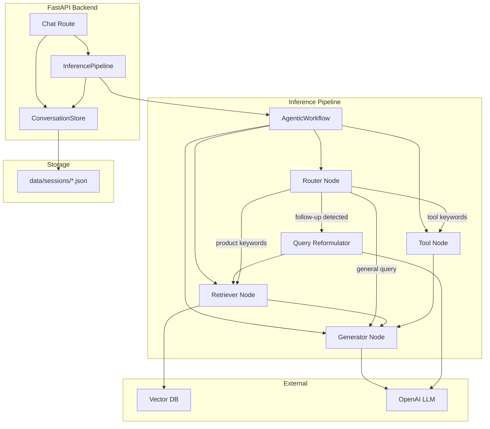
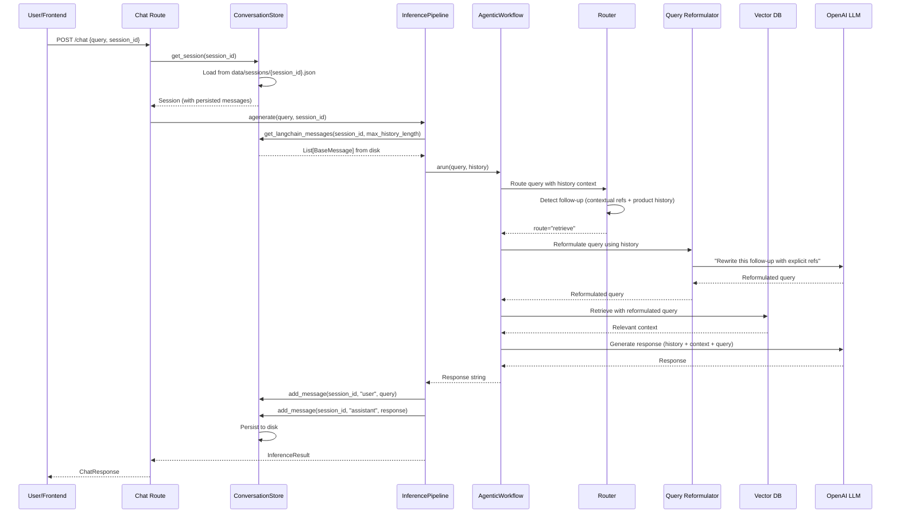

# Design Document: Multi-Turn Conversation Improvements

## Overview

This design addresses the dual-storage desynchronization bug by unifying conversation persistence into a single `ConversationStore` that replaces both the in-memory `ConversationManager` and the file-based `SessionStore`. The unified store persists to JSON files (reusing the existing `data/sessions/` directory and file-locking strategy from `SessionStore`) while also providing LangChain message conversion (currently in `ConversationManager`). Additionally, the agentic workflow's router is enhanced to detect follow-up queries using conversation history, and a query reformulation step is added so that context-dependent follow-ups trigger proper vector DB retrieval.

### Key Design Decisions

1. **File-based JSON persistence retained**: The existing `SessionStore` file format and locking mechanism are proven and sufficient. No need to introduce a database for conversation storage at this stage.
2. **Single component replaces two**: `ConversationStore` merges the responsibilities of `ConversationManager` (LangChain conversion, history trimming) and `SessionStore` (file persistence, session CRUD). Both old classes are removed.
3. **History-aware routing via conversation context**: The router node gains access to recent conversation history to detect follow-up queries that lack explicit product keywords but reference prior product context.
4. **Query reformulation before retrieval**: When a follow-up is detected, the system uses the LLM to reformulate the query with explicit references extracted from history before hitting the vector DB.
5. **InferencePipeline loads history from disk**: On `agenerate`/`generate`, the pipeline reads history from the `ConversationStore` (which reads from disk), eliminating the in-memory-only gap after restarts.

## Architecture



### Request Flow (Post-Restart Scenario)



## Components and Interfaces

### 1. ConversationStore (replaces ConversationManager + SessionStore)

**File**: `src/pipelines/inference/conversation/store.py`

This is the single source of truth for all conversation data. It combines file-based persistence from `SessionStore` with LangChain message conversion from `ConversationManager`.

```python
class ConversationStore:
    """Unified persistent conversation storage.
    
    Replaces both ConversationManager (in-memory) and SessionStore (file-based).
    All reads go to disk. Writes persist immediately.
    """
    
    def __init__(self, storage_dir: str = "data/sessions", max_history_length: int = 10):
        ...
    
    # Session lifecycle
    def create_session(self) -> Session:
        """Create a new session with unique ID, persist to disk."""
        ...
    
    def get_session(self, session_id: str) -> Optional[Session]:
        """Load session from disk. Returns None if not found."""
        ...
    
    def list_sessions(self) -> List[Session]:
        """List all sessions sorted by most recent first."""
        ...
    
    def delete_session(self, session_id: str) -> bool:
        """Delete session file from disk."""
        ...
    
    # Message operations
    def add_message(self, session_id: str, role: str, content: str) -> Optional[Session]:
        """Add message to session and persist to disk immediately.
        
        Raises:
            ValueError: If role is not 'user' or 'assistant'
            SessionError: If session not found or write fails
        """
        ...
    
    # LangChain integration (from ConversationManager)
    def get_langchain_messages(
        self, session_id: str, limit: Optional[int] = None
    ) -> List[BaseMessage]:
        """Load session from disk, convert to LangChain messages.
        
        Args:
            session_id: Session identifier
            limit: Max messages to return (uses max_history_length if None)
        
        Returns:
            List of HumanMessage/AIMessage in chronological order
        """
        ...
    
    def get_history(self, session_id: str, limit: Optional[int] = None) -> List[Message]:
        """Get raw message history from disk.
        
        Args:
            session_id: Session identifier  
            limit: Max messages to return (uses max_history_length if None)
        """
        ...
```

### 2. Updated Router Node

**File**: `src/pipelines/inference/workflow/agentic.py` (modified `_router_node`)

The router gains history-awareness to detect follow-up queries.

```python
def _router_node(self, state: AgentState) -> Dict[str, Any]:
    """Route query considering conversation history for follow-ups.
    
    Routing logic (in priority order):
    1. Tool keywords detected → route to "tool"
    2. Product keywords detected → route to "retrieve" 
    3. Follow-up detected (contextual refs + product in recent history) → route to "retrieve"
    4. Default → route to "respond" (direct generation)
    """
    ...

def _is_follow_up_query(self, query: str, history: List[BaseMessage]) -> bool:
    """Detect if query is a follow-up referencing prior product context.
    
    Checks:
    - Query contains contextual references (pronouns, "tell me more", etc.)
    - Recent assistant messages contain product-related content
    """
    ...
```

### 3. Query Reformulator

**File**: `src/pipelines/inference/workflow/reformulator.py` (new)

Reformulates follow-up queries into standalone queries using conversation history.

```python
class QueryReformulator:
    """Reformulates follow-up queries using conversation history.
    
    Uses the LLM to rewrite ambiguous follow-up queries into
    self-contained queries with explicit product/topic references.
    """
    
    def __init__(self, llm_client: LLMClient):
        ...
    
    def reformulate(self, query: str, history: List[BaseMessage]) -> str:
        """Rewrite a follow-up query as a standalone query.
        
        Args:
            query: The follow-up query (e.g., "tell me more about that one")
            history: Recent conversation history
            
        Returns:
            Reformulated query with explicit references
            (e.g., "tell me more about the Samsung Galaxy S24 Ultra")
        """
        ...
    
    async def areformulate(self, query: str, history: List[BaseMessage]) -> str:
        """Async version of reformulate."""
        ...
```

### 4. Updated InferencePipeline

**File**: `src/pipelines/inference/pipeline.py` (modified)

Key changes:
- Accepts `ConversationStore` instead of creating `ConversationManager` internally
- Loads history from `ConversationStore` (disk-backed) before workflow execution
- Saves messages via `ConversationStore` after response generation

```python
class InferencePipeline:
    def __init__(self, config: InferenceConfig, retrieval_pipeline, conversation_store: ConversationStore):
        self.conversation_store = conversation_store
        # No more self.conversation_manager
        ...
    
    def initialize(self) -> None:
        # No longer creates ConversationManager
        # ConversationStore is injected, already ready
        ...
    
    async def _aexecute_generate_workflow(self, query: str, session_id: str) -> InferenceResult:
        # Step 1: Load history from ConversationStore (reads from disk)
        history = self.conversation_store.get_langchain_messages(session_id)
        # Step 2: Execute agentic workflow with history
        response = await self.agentic_workflow.arun(query, history)
        # Step 3: Persist messages via ConversationStore (writes to disk)
        self.conversation_store.add_message(session_id, "user", query)
        self.conversation_store.add_message(session_id, "assistant", response)
        ...
```

### 5. Updated Chat Route

**File**: `src/api/routes/chat.py` (modified)

Key change: The chat route no longer calls `session_store.add_message()` separately. The `InferencePipeline` handles all message persistence through `ConversationStore`. The route only validates the session exists and delegates to the pipeline.

```python
@router.post("/chat", response_model=ChatResponse)
async def chat(request: ChatRequest, ...):
    # Verify session exists via ConversationStore
    session = conversation_store.get_session(request.session_id)
    if session is None:
        raise HTTPException(status_code=404, ...)
    
    # Generate response — pipeline handles history load + message persistence
    result = await inference_pipeline.agenerate(
        query=request.query,
        session_id=request.session_id
    )
    
    # No more separate session_store.add_message() calls
    return ChatResponse(response=result.response, ...)
```

### 6. Updated AgentState

**File**: `src/pipelines/inference/workflow/agentic.py` (modified)

```python
class AgentState(TypedDict):
    messages: Annotated[Sequence[BaseMessage], add_messages]
    context: str
    route: str
    tool_result: str
    reformulated_query: str  # NEW: holds reformulated query for retrieval
```

### 7. Updated Dependencies

**File**: `src/api/dependencies.py` (modified)

```python
from src.pipelines.inference.conversation.store import ConversationStore

_conversation_store: Optional[ConversationStore] = None

def set_conversation_store(store: ConversationStore) -> None:
    global _conversation_store
    _conversation_store = store

def get_conversation_store() -> ConversationStore:
    return _conversation_store
```

## Data Models

### Session JSON File Format (unchanged from existing SessionStore)

```json
{
  "session_id": "sess_20250101_120000_abc12345",
  "created_at": "2025-01-01T12:00:00Z",
  "updated_at": "2025-01-01T12:05:30Z",
  "messages": [
    {
      "role": "user",
      "content": "What phones do you have under $500?",
      "timestamp": "2025-01-01T12:00:01Z"
    },
    {
      "role": "assistant",
      "content": "Here are some phones under $500: ...",
      "timestamp": "2025-01-01T12:00:03Z"
    },
    {
      "role": "user",
      "content": "Tell me more about the Samsung one",
      "timestamp": "2025-01-01T12:05:28Z"
    },
    {
      "role": "assistant",
      "content": "The Samsung Galaxy A54 features ...",
      "timestamp": "2025-01-01T12:05:30Z"
    }
  ]
}
```

### Message Dataclass (in ConversationStore)

```python
@dataclass
class Message:
    role: str          # "user" or "assistant"
    content: str
    timestamp: str     # ISO 8601 format with Z suffix

@dataclass
class Session:
    session_id: str
    created_at: str    # ISO 8601
    updated_at: str    # ISO 8601
    messages: List[Message]
```

### ConversationConfig (updated)

```python
class ConversationConfig(BaseSettings):
    max_history_length: int = 10
    storage_dir: str = "data/sessions"  # NEW: configurable storage directory
```

### Follow-Up Detection Patterns

The router uses these patterns to detect follow-up queries:

```python
CONTEXTUAL_REFERENCES = [
    "that", "this", "it", "they", "them", "those", "these",
    "the one", "the same", "which one",
]

FOLLOW_UP_PHRASES = [
    "tell me more", "more about", "what about", "how about",
    "how does it", "how do they", "can you compare",
    "what's the difference", "is it better", "any other",
    "similar to", "like that", "another option",
]
```
